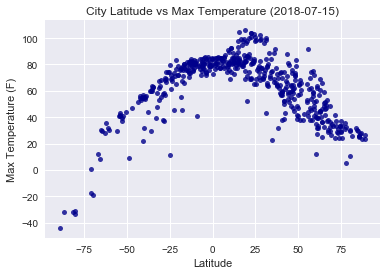
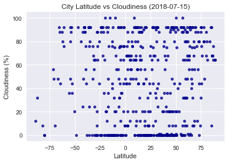
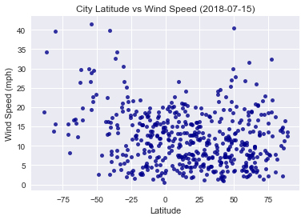

# WeatherPy

### Analysis

When comparing Latitude to Max Temperature, it is clear that the climate is hotter near the equator.

When comparing Latitude to Humidity, the climate tends to be drier near the equator, perhaps due to the hot, dry deserts where water evaporates quickly. However, the data also shows evidence of deserts near the poles, where water freezes rather quickly as well.

There is a possible trend towards it being much windier near the poles as well.  But whether this has to do with climate, open space, or low habitation is difficult to tell.


```python
import openweathermapy.core as owm
import requests
import json
from citipy import citipy
import datetime as dt
import matplotlib.pyplot as plt
import seaborn as sns
import pandas as pd
import numpy as np
import imp
api = imp.load_source('api', '/Users/thomas/Desktop/Boot Camp/Keys/api.py')
from api import owmkey
```

## Generate Cities List


```python
City = []
Country = []
Date = []
Lat = []
Lng = []
Cloudiness = []
Humidity = []
MaxTemp = []
WindSpeed = []
while len(City)<500:
    lat=np.random.uniform(-90,90)
    lng=np.random.uniform(-180,180)
    city=citipy.nearest_city(lat,lng)

    if city.city_name not in City:
        City.append(city.city_name)
        Country.append(city.country_code)
        Lat.append(f'{lat:.2f}')
        Lng.append(f'{lng:.2f}')
```

## Perform API Calls


```python
print('Beginning Data Retrieval')
print('-------------------------------')

x = 0
        
for i in range(1,11):
    for j in range(1,51):
        
        a=f'lat={Lat[x]}&lon={Lng[x]}'
        url = (f'http://api.openweathermap.org/data/2.5/weather?{a}&units=Imperial&APPID={owmkey}')
        forecast = requests.get(url).json()
        Date.append(forecast['dt'])
        Cloudiness.append(forecast['clouds']['all'])
        Humidity.append(forecast['main']['humidity'])
        MaxTemp.append(forecast['main']['temp_max'])
        WindSpeed.append(forecast['wind']['speed'])
        print(f'Processing Record {j} of Set {i} | {City[x]}')
        print(url)
        x += 1        
print('-------------------------------')
print('Data Retrieval Complete')
print('-------------------------------')
    
```

    Beginning Data Retrieval
    -------------------------------
    Processing Record 1 of Set 1 | yar-sale
    http://api.openweathermap.org/data/2.5/weather?lat=70.72&lon=69.51&units=Imperial&APPID=0b37b8414031b72ca24d1c193bb51f0c
    Processing Record 2 of Set 1 | hithadhoo
    http://api.openweathermap.org/data/2.5/weather?lat=-18.28&lon=77.53&units=Imperial&APPID=0b37b8414031b72ca24d1c193bb51f0c
    Processing Record 3 of Set 1 | taolanaro
    http://api.openweathermap.org/data/2.5/weather?lat=-65.85&lon=69.17&units=Imperial&APPID=0b37b8414031b72ca24d1c193bb51f0c
    Processing Record 4 of Set 1 | yellowknife
    http://api.openweathermap.org/data/2.5/weather?lat=75.99&lon=-104.42&units=Imperial&APPID=0b37b8414031b72ca24d1c193bb51f0c
    Processing Record 5 of Set 1 | banjar
    http://api.openweathermap.org/data/2.5/weather?lat=-10.67&lon=106.18&units=Imperial&APPID=0b37b8414031b72ca24d1c193bb51f0c
    Processing Record 6 of Set 1 | santa maria
    http://api.openweathermap.org/data/2.5/weather?lat=21.87&lon=-22.37&units=Imperial&APPID=0b37b8414031b72ca24d1c193bb51f0c
    Processing Record 7 of Set 1 | cape town
    http://api.openweathermap.org/data/2.5/weather?lat=-62.66&lon=-10.29&units=Imperial&APPID=0b37b8414031b72ca24d1c193bb51f0c
    Processing Record 8 of Set 1 | esperance
    http://api.openweathermap.org/data/2.5/weather?lat=-27.44&lon=122.77&units=Imperial&APPID=0b37b8414031b72ca24d1c193bb51f0c
    Processing Record 9 of Set 1 | troitsko-pechorsk
    http://api.openweathermap.org/data/2.5/weather?lat=62.93&lon=57.11&units=Imperial&APPID=0b37b8414031b72ca24d1c193bb51f0c
    Processing Record 10 of Set 1 | barrow
    http://api.openweathermap.org/data/2.5/weather?lat=74.17&lon=-154.45&units=Imperial&APPID=0b37b8414031b72ca24d1c193bb51f0c
    Processing Record 11 of Set 1 | punta arenas
    http://api.openweathermap.org/data/2.5/weather?lat=-66.81&lon=-88.93&units=Imperial&APPID=0b37b8414031b72ca24d1c193bb51f0c
    Processing Record 12 of Set 1 | balkhash
    http://api.openweathermap.org/data/2.5/weather?lat=45.78&lon=76.33&units=Imperial&APPID=0b37b8414031b72ca24d1c193bb51f0c
    Processing Record 13 of Set 1 | anadyr
    http://api.openweathermap.org/data/2.5/weather?lat=63.76&lon=176.09&units=Imperial&APPID=0b37b8414031b72ca24d1c193bb51f0c
    Processing Record 14 of Set 1 | bredasdorp
    http://api.openweathermap.org/data/2.5/weather?lat=-88.96&lon=14.37&units=Imperial&APPID=0b37b8414031b72ca24d1c193bb51f0c
    Processing Record 15 of Set 1 | ushuaia
    http://api.openweathermap.org/data/2.5/weather?lat=-54.70&lon=-50.83&units=Imperial&APPID=0b37b8414031b72ca24d1c193bb51f0c
    Processing Record 16 of Set 1 | sentyabrskiy
    http://api.openweathermap.org/data/2.5/weather?lat=40.00&lon=156.79&units=Imperial&APPID=0b37b8414031b72ca24d1c193bb51f0c
    Processing Record 17 of Set 1 | chuy
    http://api.openweathermap.org/data/2.5/weather?lat=-55.85&lon=-31.68&units=Imperial&APPID=0b37b8414031b72ca24d1c193bb51f0c
    Processing Record 18 of Set 1 | butaritari
    http://api.openweathermap.org/data/2.5/weather?lat=26.41&lon=170.20&units=Imperial&APPID=0b37b8414031b72ca24d1c193bb51f0c
    Processing Record 19 of Set 1 | sabla
    http://api.openweathermap.org/data/2.5/weather?lat=43.44&lon=29.42&units=Imperial&APPID=0b37b8414031b72ca24d1c193bb51f0c
    Processing Record 20 of Set 1 | hermanus
    http://api.openweathermap.org/data/2.5/weather?lat=-65.10&lon=2.15&units=Imperial&APPID=0b37b8414031b72ca24d1c193bb51f0c
    Processing Record 21 of Set 1 | busselton
    http://api.openweathermap.org/data/2.5/weather?lat=-87.14&lon=86.95&units=Imperial&APPID=0b37b8414031b72ca24d1c193bb51f0c
    Processing Record 22 of Set 1 | lolua
    http://api.openweathermap.org/data/2.5/weather?lat=-6.02&lon=176.89&units=Imperial&APPID=0b37b8414031b72ca24d1c193bb51f0c
    Processing Record 23 of Set 1 | tuktoyaktuk
    http://api.openweathermap.org/data/2.5/weather?lat=89.05&lon=-139.42&units=Imperial&APPID=0b37b8414031b72ca24d1c193bb51f0c
    Processing Record 24 of Set 1 | balkanabat
    http://api.openweathermap.org/data/2.5/weather?lat=39.24&lon=53.50&units=Imperial&APPID=0b37b8414031b72ca24d1c193bb51f0c
    Processing Record 25 of Set 1 | olafsvik
    http://api.openweathermap.org/data/2.5/weather?lat=63.03&lon=-27.12&units=Imperial&APPID=0b37b8414031b72ca24d1c193bb51f0c
    Processing Record 26 of Set 1 | arraial do cabo
    http://api.openweathermap.org/data/2.5/weather?lat=-38.79&lon=-34.70&units=Imperial&APPID=0b37b8414031b72ca24d1c193bb51f0c
    Processing Record 27 of Set 1 | kasempa
    http://api.openweathermap.org/data/2.5/weather?lat=-13.89&lon=26.35&units=Imperial&APPID=0b37b8414031b72ca24d1c193bb51f0c
    Processing Record 28 of Set 1 | puerto ayora
    http://api.openweathermap.org/data/2.5/weather?lat=-17.09&lon=-100.92&units=Imperial&APPID=0b37b8414031b72ca24d1c193bb51f0c
    Processing Record 29 of Set 1 | mahebourg
    http://api.openweathermap.org/data/2.5/weather?lat=-39.32&lon=70.25&units=Imperial&APPID=0b37b8414031b72ca24d1c193bb51f0c
    Processing Record 30 of Set 1 | new norfolk
    http://api.openweathermap.org/data/2.5/weather?lat=-52.55&lon=135.54&units=Imperial&APPID=0b37b8414031b72ca24d1c193bb51f0c
    Processing Record 31 of Set 1 | coromandel
    http://api.openweathermap.org/data/2.5/weather?lat=-18.59&lon=-47.18&units=Imperial&APPID=0b37b8414031b72ca24d1c193bb51f0c
    Processing Record 32 of Set 1 | mataura
    http://api.openweathermap.org/data/2.5/weather?lat=-80.39&lon=-141.94&units=Imperial&APPID=0b37b8414031b72ca24d1c193bb51f0c
    Processing Record 33 of Set 1 | fortuna
    http://api.openweathermap.org/data/2.5/weather?lat=32.06&lon=-138.55&units=Imperial&APPID=0b37b8414031b72ca24d1c193bb51f0c
    Processing Record 34 of Set 1 | karamay
    http://api.openweathermap.org/data/2.5/weather?lat=45.97&lon=84.02&units=Imperial&APPID=0b37b8414031b72ca24d1c193bb51f0c
    Processing Record 35 of Set 1 | salalah
    http://api.openweathermap.org/data/2.5/weather?lat=14.47&lon=61.20&units=Imperial&APPID=0b37b8414031b72ca24d1c193bb51f0c
    Processing Record 36 of Set 1 | koslan
    http://api.openweathermap.org/data/2.5/weather?lat=63.79&lon=49.42&units=Imperial&APPID=0b37b8414031b72ca24d1c193bb51f0c
    Processing Record 37 of Set 1 | itarema
    http://api.openweathermap.org/data/2.5/weather?lat=4.19&lon=-36.64&units=Imperial&APPID=0b37b8414031b72ca24d1c193bb51f0c
    Processing Record 38 of Set 1 | kibi
    http://api.openweathermap.org/data/2.5/weather?lat=6.27&lon=-0.70&units=Imperial&APPID=0b37b8414031b72ca24d1c193bb51f0c
    Processing Record 39 of Set 1 | dikson
    http://api.openweathermap.org/data/2.5/weather?lat=85.43&lon=79.61&units=Imperial&APPID=0b37b8414031b72ca24d1c193bb51f0c
    Processing Record 40 of Set 1 | kloulklubed
    http://api.openweathermap.org/data/2.5/weather?lat=6.83&lon=132.98&units=Imperial&APPID=0b37b8414031b72ca24d1c193bb51f0c
    Processing Record 41 of Set 1 | novyy yegorlyk
    http://api.openweathermap.org/data/2.5/weather?lat=46.34&lon=41.89&units=Imperial&APPID=0b37b8414031b72ca24d1c193bb51f0c
    Processing Record 42 of Set 1 | cam pha
    http://api.openweathermap.org/data/2.5/weather?lat=20.37&lon=107.63&units=Imperial&APPID=0b37b8414031b72ca24d1c193bb51f0c
    Processing Record 43 of Set 1 | avarua
    http://api.openweathermap.org/data/2.5/weather?lat=-42.29&lon=-159.86&units=Imperial&APPID=0b37b8414031b72ca24d1c193bb51f0c
    Processing Record 44 of Set 1 | alyangula
    http://api.openweathermap.org/data/2.5/weather?lat=-13.16&lon=136.04&units=Imperial&APPID=0b37b8414031b72ca24d1c193bb51f0c
    Processing Record 45 of Set 1 | villa bruzual
    http://api.openweathermap.org/data/2.5/weather?lat=8.68&lon=-68.57&units=Imperial&APPID=0b37b8414031b72ca24d1c193bb51f0c
    Processing Record 46 of Set 1 | illapel
    http://api.openweathermap.org/data/2.5/weather?lat=-31.20&lon=-71.84&units=Imperial&APPID=0b37b8414031b72ca24d1c193bb51f0c
    Processing Record 47 of Set 1 | uwayl
    http://api.openweathermap.org/data/2.5/weather?lat=9.40&lon=26.45&units=Imperial&APPID=0b37b8414031b72ca24d1c193bb51f0c
    Processing Record 48 of Set 1 | lasa
    http://api.openweathermap.org/data/2.5/weather?lat=31.33&lon=87.81&units=Imperial&APPID=0b37b8414031b72ca24d1c193bb51f0c
    Processing Record 49 of Set 1 | honavar
    http://api.openweathermap.org/data/2.5/weather?lat=13.93&lon=73.90&units=Imperial&APPID=0b37b8414031b72ca24d1c193bb51f0c
    Processing Record 50 of Set 1 | castro
    http://api.openweathermap.org/data/2.5/weather?lat=-54.31&lon=-104.32&units=Imperial&APPID=0b37b8414031b72ca24d1c193bb51f0c
    Processing Record 1 of Set 2 | rikitea
    http://api.openweathermap.org/data/2.5/weather?lat=-81.75&lon=-126.46&units=Imperial&APPID=0b37b8414031b72ca24d1c193bb51f0c
    Processing Record 2 of Set 2 | pringsewu
    http://api.openweathermap.org/data/2.5/weather?lat=-5.15&lon=104.08&units=Imperial&APPID=0b37b8414031b72ca24d1c193bb51f0c
    Processing Record 3 of Set 2 | agirish
    http://api.openweathermap.org/data/2.5/weather?lat=63.93&lon=62.47&units=Imperial&APPID=0b37b8414031b72ca24d1c193bb51f0c
    Processing Record 4 of Set 2 | barentsburg
    http://api.openweathermap.org/data/2.5/weather?lat=77.48&lon=1.61&units=Imperial&APPID=0b37b8414031b72ca24d1c193bb51f0c
    Processing Record 5 of Set 2 | menongue
    http://api.openweathermap.org/data/2.5/weather?lat=-14.45&lon=18.64&units=Imperial&APPID=0b37b8414031b72ca24d1c193bb51f0c
    Processing Record 6 of Set 2 | kholm
    http://api.openweathermap.org/data/2.5/weather?lat=59.25&lon=33.02&units=Imperial&APPID=0b37b8414031b72ca24d1c193bb51f0c
    Processing Record 7 of Set 2 | emba
    http://api.openweathermap.org/data/2.5/weather?lat=48.36&lon=59.10&units=Imperial&APPID=0b37b8414031b72ca24d1c193bb51f0c
    Processing Record 8 of Set 2 | bengkulu
    http://api.openweathermap.org/data/2.5/weather?lat=-10.74&lon=98.74&units=Imperial&APPID=0b37b8414031b72ca24d1c193bb51f0c
    Processing Record 9 of Set 2 | sao borja
    http://api.openweathermap.org/data/2.5/weather?lat=-28.93&lon=-55.77&units=Imperial&APPID=0b37b8414031b72ca24d1c193bb51f0c
    Processing Record 10 of Set 2 | lundazi
    http://api.openweathermap.org/data/2.5/weather?lat=-12.15&lon=32.72&units=Imperial&APPID=0b37b8414031b72ca24d1c193bb51f0c
    Processing Record 11 of Set 2 | yumen
    http://api.openweathermap.org/data/2.5/weather?lat=43.63&lon=97.76&units=Imperial&APPID=0b37b8414031b72ca24d1c193bb51f0c
    Processing Record 12 of Set 2 | porbandar
    http://api.openweathermap.org/data/2.5/weather?lat=19.00&lon=67.47&units=Imperial&APPID=0b37b8414031b72ca24d1c193bb51f0c
    Processing Record 13 of Set 2 | albany
    http://api.openweathermap.org/data/2.5/weather?lat=-60.63&lon=116.13&units=Imperial&APPID=0b37b8414031b72ca24d1c193bb51f0c
    Processing Record 14 of Set 2 | katsuura
    http://api.openweathermap.org/data/2.5/weather?lat=19.44&lon=150.45&units=Imperial&APPID=0b37b8414031b72ca24d1c193bb51f0c
    Processing Record 15 of Set 2 | chokwe
    http://api.openweathermap.org/data/2.5/weather?lat=-24.71&lon=32.96&units=Imperial&APPID=0b37b8414031b72ca24d1c193bb51f0c
    Processing Record 16 of Set 2 | nouadhibou
    http://api.openweathermap.org/data/2.5/weather?lat=21.25&lon=-15.81&units=Imperial&APPID=0b37b8414031b72ca24d1c193bb51f0c
    Processing Record 17 of Set 2 | keshan
    http://api.openweathermap.org/data/2.5/weather?lat=48.58&lon=125.91&units=Imperial&APPID=0b37b8414031b72ca24d1c193bb51f0c
    Processing Record 18 of Set 2 | pacific grove
    http://api.openweathermap.org/data/2.5/weather?lat=25.33&lon=-136.08&units=Imperial&APPID=0b37b8414031b72ca24d1c193bb51f0c
    Processing Record 19 of Set 2 | saint george
    http://api.openweathermap.org/data/2.5/weather?lat=37.97&lon=-61.40&units=Imperial&APPID=0b37b8414031b72ca24d1c193bb51f0c
    Processing Record 20 of Set 2 | vila do maio
    http://api.openweathermap.org/data/2.5/weather?lat=12.34&lon=-20.86&units=Imperial&APPID=0b37b8414031b72ca24d1c193bb51f0c
    Processing Record 21 of Set 2 | mayo
    http://api.openweathermap.org/data/2.5/weather?lat=66.50&lon=-140.60&units=Imperial&APPID=0b37b8414031b72ca24d1c193bb51f0c
    Processing Record 22 of Set 2 | bacolod
    http://api.openweathermap.org/data/2.5/weather?lat=9.68&lon=128.76&units=Imperial&APPID=0b37b8414031b72ca24d1c193bb51f0c
    Processing Record 23 of Set 2 | batagay-alyta
    http://api.openweathermap.org/data/2.5/weather?lat=66.70&lon=129.36&units=Imperial&APPID=0b37b8414031b72ca24d1c193bb51f0c
    Processing Record 24 of Set 2 | lebu
    http://api.openweathermap.org/data/2.5/weather?lat=-34.87&lon=-97.38&units=Imperial&APPID=0b37b8414031b72ca24d1c193bb51f0c
    Processing Record 25 of Set 2 | bjornevatn
    http://api.openweathermap.org/data/2.5/weather?lat=68.47&lon=28.74&units=Imperial&APPID=0b37b8414031b72ca24d1c193bb51f0c
    Processing Record 26 of Set 2 | kavieng
    http://api.openweathermap.org/data/2.5/weather?lat=15.99&lon=152.05&units=Imperial&APPID=0b37b8414031b72ca24d1c193bb51f0c
    Processing Record 27 of Set 2 | saint-philippe
    http://api.openweathermap.org/data/2.5/weather?lat=-60.90&lon=67.57&units=Imperial&APPID=0b37b8414031b72ca24d1c193bb51f0c
    Processing Record 28 of Set 2 | nizhneyansk
    http://api.openweathermap.org/data/2.5/weather?lat=87.00&lon=142.99&units=Imperial&APPID=0b37b8414031b72ca24d1c193bb51f0c
    Processing Record 29 of Set 2 | lar
    http://api.openweathermap.org/data/2.5/weather?lat=27.97&lon=54.67&units=Imperial&APPID=0b37b8414031b72ca24d1c193bb51f0c
    Processing Record 30 of Set 2 | bluff
    http://api.openweathermap.org/data/2.5/weather?lat=-69.88&lon=163.49&units=Imperial&APPID=0b37b8414031b72ca24d1c193bb51f0c
    Processing Record 31 of Set 2 | jamestown
    http://api.openweathermap.org/data/2.5/weather?lat=-7.27&lon=-2.75&units=Imperial&APPID=0b37b8414031b72ca24d1c193bb51f0c
    Processing Record 32 of Set 2 | hillsborough
    http://api.openweathermap.org/data/2.5/weather?lat=12.40&lon=-61.16&units=Imperial&APPID=0b37b8414031b72ca24d1c193bb51f0c
    Processing Record 33 of Set 2 | pemangkat
    http://api.openweathermap.org/data/2.5/weather?lat=2.74&lon=108.57&units=Imperial&APPID=0b37b8414031b72ca24d1c193bb51f0c
    Processing Record 34 of Set 2 | utiroa
    http://api.openweathermap.org/data/2.5/weather?lat=-4.08&lon=170.12&units=Imperial&APPID=0b37b8414031b72ca24d1c193bb51f0c
    Processing Record 35 of Set 2 | illoqqortoormiut
    http://api.openweathermap.org/data/2.5/weather?lat=87.28&lon=-12.59&units=Imperial&APPID=0b37b8414031b72ca24d1c193bb51f0c
    Processing Record 36 of Set 2 | hobart
    http://api.openweathermap.org/data/2.5/weather?lat=-80.25&lon=150.76&units=Imperial&APPID=0b37b8414031b72ca24d1c193bb51f0c
    Processing Record 37 of Set 2 | carnarvon
    http://api.openweathermap.org/data/2.5/weather?lat=-32.27&lon=21.25&units=Imperial&APPID=0b37b8414031b72ca24d1c193bb51f0c
    Processing Record 38 of Set 2 | salta
    http://api.openweathermap.org/data/2.5/weather?lat=-24.91&lon=-67.05&units=Imperial&APPID=0b37b8414031b72ca24d1c193bb51f0c
    Processing Record 39 of Set 2 | honningsvag
    http://api.openweathermap.org/data/2.5/weather?lat=71.60&lon=25.53&units=Imperial&APPID=0b37b8414031b72ca24d1c193bb51f0c
    Processing Record 40 of Set 2 | mount gambier
    http://api.openweathermap.org/data/2.5/weather?lat=-50.41&lon=129.82&units=Imperial&APPID=0b37b8414031b72ca24d1c193bb51f0c
    Processing Record 41 of Set 2 | leningradskiy
    http://api.openweathermap.org/data/2.5/weather?lat=83.62&lon=176.03&units=Imperial&APPID=0b37b8414031b72ca24d1c193bb51f0c
    Processing Record 42 of Set 2 | upernavik
    http://api.openweathermap.org/data/2.5/weather?lat=71.56&lon=-54.05&units=Imperial&APPID=0b37b8414031b72ca24d1c193bb51f0c
    Processing Record 43 of Set 2 | sayyan
    http://api.openweathermap.org/data/2.5/weather?lat=15.55&lon=46.08&units=Imperial&APPID=0b37b8414031b72ca24d1c193bb51f0c
    Processing Record 44 of Set 2 | coruripe
    http://api.openweathermap.org/data/2.5/weather?lat=-10.77&lon=-35.43&units=Imperial&APPID=0b37b8414031b72ca24d1c193bb51f0c
    Processing Record 45 of Set 2 | raudeberg
    http://api.openweathermap.org/data/2.5/weather?lat=65.83&lon=1.84&units=Imperial&APPID=0b37b8414031b72ca24d1c193bb51f0c
    Processing Record 46 of Set 2 | peace river
    http://api.openweathermap.org/data/2.5/weather?lat=56.74&lon=-116.18&units=Imperial&APPID=0b37b8414031b72ca24d1c193bb51f0c
    Processing Record 47 of Set 2 | chirongui
    http://api.openweathermap.org/data/2.5/weather?lat=-13.63&lon=45.17&units=Imperial&APPID=0b37b8414031b72ca24d1c193bb51f0c
    Processing Record 48 of Set 2 | warqla
    http://api.openweathermap.org/data/2.5/weather?lat=32.95&lon=4.45&units=Imperial&APPID=0b37b8414031b72ca24d1c193bb51f0c
    Processing Record 49 of Set 2 | lexington
    http://api.openweathermap.org/data/2.5/weather?lat=40.59&lon=-99.70&units=Imperial&APPID=0b37b8414031b72ca24d1c193bb51f0c
    Processing Record 50 of Set 2 | gat
    http://api.openweathermap.org/data/2.5/weather?lat=27.45&lon=6.35&units=Imperial&APPID=0b37b8414031b72ca24d1c193bb51f0c
    Processing Record 1 of Set 3 | namibe
    http://api.openweathermap.org/data/2.5/weather?lat=-11.70&lon=5.18&units=Imperial&APPID=0b37b8414031b72ca24d1c193bb51f0c
    Processing Record 2 of Set 3 | krasnovishersk
    http://api.openweathermap.org/data/2.5/weather?lat=60.33&lon=58.15&units=Imperial&APPID=0b37b8414031b72ca24d1c193bb51f0c
    Processing Record 3 of Set 3 | georgetown
    http://api.openweathermap.org/data/2.5/weather?lat=-1.40&lon=-17.65&units=Imperial&APPID=0b37b8414031b72ca24d1c193bb51f0c
    Processing Record 4 of Set 3 | marzuq
    http://api.openweathermap.org/data/2.5/weather?lat=24.88&lon=17.29&units=Imperial&APPID=0b37b8414031b72ca24d1c193bb51f0c
    Processing Record 5 of Set 3 | saldanha
    http://api.openweathermap.org/data/2.5/weather?lat=-40.62&lon=-4.08&units=Imperial&APPID=0b37b8414031b72ca24d1c193bb51f0c
    Processing Record 6 of Set 3 | kattivakkam
    http://api.openweathermap.org/data/2.5/weather?lat=13.55&lon=82.98&units=Imperial&APPID=0b37b8414031b72ca24d1c193bb51f0c
    Processing Record 7 of Set 3 | nikolskoye
    http://api.openweathermap.org/data/2.5/weather?lat=35.85&lon=176.18&units=Imperial&APPID=0b37b8414031b72ca24d1c193bb51f0c
    Processing Record 8 of Set 3 | coahuayana
    http://api.openweathermap.org/data/2.5/weather?lat=14.66&lon=-105.06&units=Imperial&APPID=0b37b8414031b72ca24d1c193bb51f0c
    Processing Record 9 of Set 3 | ust-nera
    http://api.openweathermap.org/data/2.5/weather?lat=63.04&lon=143.05&units=Imperial&APPID=0b37b8414031b72ca24d1c193bb51f0c
    Processing Record 10 of Set 3 | atuona
    http://api.openweathermap.org/data/2.5/weather?lat=-1.52&lon=-132.07&units=Imperial&APPID=0b37b8414031b72ca24d1c193bb51f0c
    Processing Record 11 of Set 3 | palm valley
    http://api.openweathermap.org/data/2.5/weather?lat=30.15&lon=-81.14&units=Imperial&APPID=0b37b8414031b72ca24d1c193bb51f0c
    Processing Record 12 of Set 3 | port alfred
    http://api.openweathermap.org/data/2.5/weather?lat=-70.89&lon=36.68&units=Imperial&APPID=0b37b8414031b72ca24d1c193bb51f0c
    Processing Record 13 of Set 3 | zykovo
    http://api.openweathermap.org/data/2.5/weather?lat=55.86&lon=93.00&units=Imperial&APPID=0b37b8414031b72ca24d1c193bb51f0c
    Processing Record 14 of Set 3 | saskylakh
    http://api.openweathermap.org/data/2.5/weather?lat=80.43&lon=116.59&units=Imperial&APPID=0b37b8414031b72ca24d1c193bb51f0c
    Processing Record 15 of Set 3 | wonthaggi
    http://api.openweathermap.org/data/2.5/weather?lat=-39.37&lon=146.30&units=Imperial&APPID=0b37b8414031b72ca24d1c193bb51f0c
    Processing Record 16 of Set 3 | chenghai
    http://api.openweathermap.org/data/2.5/weather?lat=23.20&lon=117.45&units=Imperial&APPID=0b37b8414031b72ca24d1c193bb51f0c
    Processing Record 17 of Set 3 | kodiak
    http://api.openweathermap.org/data/2.5/weather?lat=45.83&lon=-147.62&units=Imperial&APPID=0b37b8414031b72ca24d1c193bb51f0c
    Processing Record 18 of Set 3 | saleaula
    http://api.openweathermap.org/data/2.5/weather?lat=-1.62&lon=-166.79&units=Imperial&APPID=0b37b8414031b72ca24d1c193bb51f0c
    Processing Record 19 of Set 3 | cherskiy
    http://api.openweathermap.org/data/2.5/weather?lat=64.96&lon=162.34&units=Imperial&APPID=0b37b8414031b72ca24d1c193bb51f0c
    Processing Record 20 of Set 3 | kirando
    http://api.openweathermap.org/data/2.5/weather?lat=-7.72&lon=30.39&units=Imperial&APPID=0b37b8414031b72ca24d1c193bb51f0c
    Processing Record 21 of Set 3 | hobyo
    http://api.openweathermap.org/data/2.5/weather?lat=2.42&lon=52.03&units=Imperial&APPID=0b37b8414031b72ca24d1c193bb51f0c
    Processing Record 22 of Set 3 | winnemucca
    http://api.openweathermap.org/data/2.5/weather?lat=42.22&lon=-119.04&units=Imperial&APPID=0b37b8414031b72ca24d1c193bb51f0c
    Processing Record 23 of Set 3 | moron
    http://api.openweathermap.org/data/2.5/weather?lat=50.45&lon=100.82&units=Imperial&APPID=0b37b8414031b72ca24d1c193bb51f0c
    Processing Record 24 of Set 3 | domoni
    http://api.openweathermap.org/data/2.5/weather?lat=-10.39&lon=46.08&units=Imperial&APPID=0b37b8414031b72ca24d1c193bb51f0c
    Processing Record 25 of Set 3 | samusu
    http://api.openweathermap.org/data/2.5/weather?lat=-12.84&lon=-164.06&units=Imperial&APPID=0b37b8414031b72ca24d1c193bb51f0c
    Processing Record 26 of Set 3 | kaitangata
    http://api.openweathermap.org/data/2.5/weather?lat=-62.08&lon=180.00&units=Imperial&APPID=0b37b8414031b72ca24d1c193bb51f0c
    Processing Record 27 of Set 3 | lucapa
    http://api.openweathermap.org/data/2.5/weather?lat=-9.12&lon=21.11&units=Imperial&APPID=0b37b8414031b72ca24d1c193bb51f0c
    Processing Record 28 of Set 3 | mar del plata
    http://api.openweathermap.org/data/2.5/weather?lat=-53.12&lon=-48.58&units=Imperial&APPID=0b37b8414031b72ca24d1c193bb51f0c
    Processing Record 29 of Set 3 | hailar
    http://api.openweathermap.org/data/2.5/weather?lat=47.90&lon=118.60&units=Imperial&APPID=0b37b8414031b72ca24d1c193bb51f0c
    Processing Record 30 of Set 3 | mandera
    http://api.openweathermap.org/data/2.5/weather?lat=4.57&lon=40.57&units=Imperial&APPID=0b37b8414031b72ca24d1c193bb51f0c
    Processing Record 31 of Set 3 | daru
    http://api.openweathermap.org/data/2.5/weather?lat=-10.01&lon=142.05&units=Imperial&APPID=0b37b8414031b72ca24d1c193bb51f0c
    Processing Record 32 of Set 3 | ginda
    http://api.openweathermap.org/data/2.5/weather?lat=15.04&lon=39.69&units=Imperial&APPID=0b37b8414031b72ca24d1c193bb51f0c
    Processing Record 33 of Set 3 | cua
    http://api.openweathermap.org/data/2.5/weather?lat=9.79&lon=-66.96&units=Imperial&APPID=0b37b8414031b72ca24d1c193bb51f0c
    Processing Record 34 of Set 3 | berlevag
    http://api.openweathermap.org/data/2.5/weather?lat=85.86&lon=33.19&units=Imperial&APPID=0b37b8414031b72ca24d1c193bb51f0c
    Processing Record 35 of Set 3 | paita
    http://api.openweathermap.org/data/2.5/weather?lat=-6.95&lon=-85.75&units=Imperial&APPID=0b37b8414031b72ca24d1c193bb51f0c
    Processing Record 36 of Set 3 | waingapu
    http://api.openweathermap.org/data/2.5/weather?lat=-11.66&lon=119.87&units=Imperial&APPID=0b37b8414031b72ca24d1c193bb51f0c
    Processing Record 37 of Set 3 | vaini
    http://api.openweathermap.org/data/2.5/weather?lat=-54.25&lon=-168.22&units=Imperial&APPID=0b37b8414031b72ca24d1c193bb51f0c
    Processing Record 38 of Set 3 | nyagan
    http://api.openweathermap.org/data/2.5/weather?lat=61.78&lon=65.54&units=Imperial&APPID=0b37b8414031b72ca24d1c193bb51f0c
    Processing Record 39 of Set 3 | kargasok
    http://api.openweathermap.org/data/2.5/weather?lat=60.60&lon=80.74&units=Imperial&APPID=0b37b8414031b72ca24d1c193bb51f0c
    Processing Record 40 of Set 3 | preobrazheniye
    http://api.openweathermap.org/data/2.5/weather?lat=43.12&lon=134.47&units=Imperial&APPID=0b37b8414031b72ca24d1c193bb51f0c
    Processing Record 41 of Set 3 | hearst
    http://api.openweathermap.org/data/2.5/weather?lat=49.70&lon=-84.16&units=Imperial&APPID=0b37b8414031b72ca24d1c193bb51f0c
    Processing Record 42 of Set 3 | sao filipe
    http://api.openweathermap.org/data/2.5/weather?lat=10.57&lon=-29.46&units=Imperial&APPID=0b37b8414031b72ca24d1c193bb51f0c
    Processing Record 43 of Set 3 | bethel
    http://api.openweathermap.org/data/2.5/weather?lat=61.98&lon=-157.74&units=Imperial&APPID=0b37b8414031b72ca24d1c193bb51f0c
    Processing Record 44 of Set 3 | tasiilaq
    http://api.openweathermap.org/data/2.5/weather?lat=80.27&lon=-35.28&units=Imperial&APPID=0b37b8414031b72ca24d1c193bb51f0c
    Processing Record 45 of Set 3 | huilong
    http://api.openweathermap.org/data/2.5/weather?lat=31.97&lon=124.71&units=Imperial&APPID=0b37b8414031b72ca24d1c193bb51f0c
    Processing Record 46 of Set 3 | makakilo city
    http://api.openweathermap.org/data/2.5/weather?lat=16.29&lon=-160.17&units=Imperial&APPID=0b37b8414031b72ca24d1c193bb51f0c
    Processing Record 47 of Set 3 | boende
    http://api.openweathermap.org/data/2.5/weather?lat=-0.36&lon=21.48&units=Imperial&APPID=0b37b8414031b72ca24d1c193bb51f0c
    Processing Record 48 of Set 3 | belushya guba
    http://api.openweathermap.org/data/2.5/weather?lat=74.87&lon=56.25&units=Imperial&APPID=0b37b8414031b72ca24d1c193bb51f0c
    Processing Record 49 of Set 3 | torbay
    http://api.openweathermap.org/data/2.5/weather?lat=33.54&lon=-46.93&units=Imperial&APPID=0b37b8414031b72ca24d1c193bb51f0c
    Processing Record 50 of Set 3 | naze
    http://api.openweathermap.org/data/2.5/weather?lat=20.54&lon=141.32&units=Imperial&APPID=0b37b8414031b72ca24d1c193bb51f0c
    Processing Record 1 of Set 4 | bolungarvik
    http://api.openweathermap.org/data/2.5/weather?lat=67.75&lon=-29.35&units=Imperial&APPID=0b37b8414031b72ca24d1c193bb51f0c
    Processing Record 2 of Set 4 | saucillo
    http://api.openweathermap.org/data/2.5/weather?lat=28.17&lon=-105.21&units=Imperial&APPID=0b37b8414031b72ca24d1c193bb51f0c
    Processing Record 3 of Set 4 | podporozhye
    http://api.openweathermap.org/data/2.5/weather?lat=60.99&lon=34.73&units=Imperial&APPID=0b37b8414031b72ca24d1c193bb51f0c
    Processing Record 4 of Set 4 | broken hill
    http://api.openweathermap.org/data/2.5/weather?lat=-29.05&lon=141.66&units=Imperial&APPID=0b37b8414031b72ca24d1c193bb51f0c
    Processing Record 5 of Set 4 | labuhan
    http://api.openweathermap.org/data/2.5/weather?lat=-7.41&lon=104.08&units=Imperial&APPID=0b37b8414031b72ca24d1c193bb51f0c
    Processing Record 6 of Set 4 | takoradi
    http://api.openweathermap.org/data/2.5/weather?lat=-1.64&lon=-0.42&units=Imperial&APPID=0b37b8414031b72ca24d1c193bb51f0c
    Processing Record 7 of Set 4 | canandaigua
    http://api.openweathermap.org/data/2.5/weather?lat=42.72&lon=-77.65&units=Imperial&APPID=0b37b8414031b72ca24d1c193bb51f0c
    Processing Record 8 of Set 4 | amderma
    http://api.openweathermap.org/data/2.5/weather?lat=84.51&lon=62.75&units=Imperial&APPID=0b37b8414031b72ca24d1c193bb51f0c
    Processing Record 9 of Set 4 | longyearbyen
    http://api.openweathermap.org/data/2.5/weather?lat=85.88&lon=27.44&units=Imperial&APPID=0b37b8414031b72ca24d1c193bb51f0c
    Processing Record 10 of Set 4 | odweyne
    http://api.openweathermap.org/data/2.5/weather?lat=9.29&lon=45.70&units=Imperial&APPID=0b37b8414031b72ca24d1c193bb51f0c
    Processing Record 11 of Set 4 | codrington
    http://api.openweathermap.org/data/2.5/weather?lat=26.93&lon=-52.57&units=Imperial&APPID=0b37b8414031b72ca24d1c193bb51f0c
    Processing Record 12 of Set 4 | qaanaaq
    http://api.openweathermap.org/data/2.5/weather?lat=86.21&lon=-91.27&units=Imperial&APPID=0b37b8414031b72ca24d1c193bb51f0c
    Processing Record 13 of Set 4 | attawapiskat
    http://api.openweathermap.org/data/2.5/weather?lat=60.44&lon=-78.35&units=Imperial&APPID=0b37b8414031b72ca24d1c193bb51f0c
    Processing Record 14 of Set 4 | husavik
    http://api.openweathermap.org/data/2.5/weather?lat=68.48&lon=-15.71&units=Imperial&APPID=0b37b8414031b72ca24d1c193bb51f0c
    Processing Record 15 of Set 4 | tsihombe
    http://api.openweathermap.org/data/2.5/weather?lat=-52.83&lon=49.60&units=Imperial&APPID=0b37b8414031b72ca24d1c193bb51f0c
    Processing Record 16 of Set 4 | caravelas
    http://api.openweathermap.org/data/2.5/weather?lat=-21.26&lon=-30.89&units=Imperial&APPID=0b37b8414031b72ca24d1c193bb51f0c
    Processing Record 17 of Set 4 | ribeira grande
    http://api.openweathermap.org/data/2.5/weather?lat=29.48&lon=-34.39&units=Imperial&APPID=0b37b8414031b72ca24d1c193bb51f0c
    Processing Record 18 of Set 4 | asau
    http://api.openweathermap.org/data/2.5/weather?lat=-15.32&lon=179.86&units=Imperial&APPID=0b37b8414031b72ca24d1c193bb51f0c
    Processing Record 19 of Set 4 | khatanga
    http://api.openweathermap.org/data/2.5/weather?lat=74.70&lon=103.78&units=Imperial&APPID=0b37b8414031b72ca24d1c193bb51f0c
    Processing Record 20 of Set 4 | amberley
    http://api.openweathermap.org/data/2.5/weather?lat=-43.71&lon=174.59&units=Imperial&APPID=0b37b8414031b72ca24d1c193bb51f0c
    Processing Record 21 of Set 4 | victoria
    http://api.openweathermap.org/data/2.5/weather?lat=-6.69&lon=63.46&units=Imperial&APPID=0b37b8414031b72ca24d1c193bb51f0c
    Processing Record 22 of Set 4 | college
    http://api.openweathermap.org/data/2.5/weather?lat=64.03&lon=-148.85&units=Imperial&APPID=0b37b8414031b72ca24d1c193bb51f0c
    Processing Record 23 of Set 4 | hilo
    http://api.openweathermap.org/data/2.5/weather?lat=9.16&lon=-152.54&units=Imperial&APPID=0b37b8414031b72ca24d1c193bb51f0c
    Processing Record 24 of Set 4 | east london
    http://api.openweathermap.org/data/2.5/weather?lat=-71.27&lon=50.09&units=Imperial&APPID=0b37b8414031b72ca24d1c193bb51f0c
    Processing Record 25 of Set 4 | george
    http://api.openweathermap.org/data/2.5/weather?lat=-35.52&lon=22.48&units=Imperial&APPID=0b37b8414031b72ca24d1c193bb51f0c
    Processing Record 26 of Set 4 | hasaki
    http://api.openweathermap.org/data/2.5/weather?lat=30.77&lon=151.56&units=Imperial&APPID=0b37b8414031b72ca24d1c193bb51f0c
    Processing Record 27 of Set 4 | nsanje
    http://api.openweathermap.org/data/2.5/weather?lat=-16.95&lon=35.04&units=Imperial&APPID=0b37b8414031b72ca24d1c193bb51f0c
    Processing Record 28 of Set 4 | kamaishi
    http://api.openweathermap.org/data/2.5/weather?lat=37.35&lon=144.48&units=Imperial&APPID=0b37b8414031b72ca24d1c193bb51f0c
    Processing Record 29 of Set 4 | beeskow
    http://api.openweathermap.org/data/2.5/weather?lat=51.97&lon=14.25&units=Imperial&APPID=0b37b8414031b72ca24d1c193bb51f0c
    Processing Record 30 of Set 4 | grand river south east
    http://api.openweathermap.org/data/2.5/weather?lat=-22.41&lon=71.54&units=Imperial&APPID=0b37b8414031b72ca24d1c193bb51f0c
    Processing Record 31 of Set 4 | marawi
    http://api.openweathermap.org/data/2.5/weather?lat=19.68&lon=28.27&units=Imperial&APPID=0b37b8414031b72ca24d1c193bb51f0c
    Processing Record 32 of Set 4 | biak
    http://api.openweathermap.org/data/2.5/weather?lat=-1.95&lon=135.97&units=Imperial&APPID=0b37b8414031b72ca24d1c193bb51f0c
    Processing Record 33 of Set 4 | zunyi
    http://api.openweathermap.org/data/2.5/weather?lat=27.36&lon=106.87&units=Imperial&APPID=0b37b8414031b72ca24d1c193bb51f0c
    Processing Record 34 of Set 4 | san miguel
    http://api.openweathermap.org/data/2.5/weather?lat=11.33&lon=124.88&units=Imperial&APPID=0b37b8414031b72ca24d1c193bb51f0c
    Processing Record 35 of Set 4 | vardo
    http://api.openweathermap.org/data/2.5/weather?lat=80.23&lon=35.51&units=Imperial&APPID=0b37b8414031b72ca24d1c193bb51f0c
    Processing Record 36 of Set 4 | ambanja
    http://api.openweathermap.org/data/2.5/weather?lat=-13.00&lon=48.13&units=Imperial&APPID=0b37b8414031b72ca24d1c193bb51f0c
    Processing Record 37 of Set 4 | vestmannaeyjar
    http://api.openweathermap.org/data/2.5/weather?lat=59.54&lon=-17.77&units=Imperial&APPID=0b37b8414031b72ca24d1c193bb51f0c
    Processing Record 38 of Set 4 | yeppoon
    http://api.openweathermap.org/data/2.5/weather?lat=-20.04&lon=154.25&units=Imperial&APPID=0b37b8414031b72ca24d1c193bb51f0c
    Processing Record 39 of Set 4 | cidreira
    http://api.openweathermap.org/data/2.5/weather?lat=-36.42&lon=-41.89&units=Imperial&APPID=0b37b8414031b72ca24d1c193bb51f0c
    Processing Record 40 of Set 4 | rosario
    http://api.openweathermap.org/data/2.5/weather?lat=-33.11&lon=-60.81&units=Imperial&APPID=0b37b8414031b72ca24d1c193bb51f0c
    Processing Record 41 of Set 4 | chom bung
    http://api.openweathermap.org/data/2.5/weather?lat=13.16&lon=99.21&units=Imperial&APPID=0b37b8414031b72ca24d1c193bb51f0c
    Processing Record 42 of Set 4 | srednekolymsk
    http://api.openweathermap.org/data/2.5/weather?lat=68.91&lon=154.47&units=Imperial&APPID=0b37b8414031b72ca24d1c193bb51f0c
    Processing Record 43 of Set 4 | malibu
    http://api.openweathermap.org/data/2.5/weather?lat=33.46&lon=-119.06&units=Imperial&APPID=0b37b8414031b72ca24d1c193bb51f0c
    Processing Record 44 of Set 4 | tunxi
    http://api.openweathermap.org/data/2.5/weather?lat=29.90&lon=118.51&units=Imperial&APPID=0b37b8414031b72ca24d1c193bb51f0c
    Processing Record 45 of Set 4 | mys shmidta
    http://api.openweathermap.org/data/2.5/weather?lat=74.79&lon=-174.52&units=Imperial&APPID=0b37b8414031b72ca24d1c193bb51f0c
    Processing Record 46 of Set 4 | devils lake
    http://api.openweathermap.org/data/2.5/weather?lat=47.84&lon=-98.43&units=Imperial&APPID=0b37b8414031b72ca24d1c193bb51f0c
    Processing Record 47 of Set 4 | meyungs
    http://api.openweathermap.org/data/2.5/weather?lat=15.48&lon=133.15&units=Imperial&APPID=0b37b8414031b72ca24d1c193bb51f0c
    Processing Record 48 of Set 4 | llata
    http://api.openweathermap.org/data/2.5/weather?lat=-8.93&lon=-76.70&units=Imperial&APPID=0b37b8414031b72ca24d1c193bb51f0c
    Processing Record 49 of Set 4 | port antonio
    http://api.openweathermap.org/data/2.5/weather?lat=18.26&lon=-75.87&units=Imperial&APPID=0b37b8414031b72ca24d1c193bb51f0c
    Processing Record 50 of Set 4 | tyukhtet
    http://api.openweathermap.org/data/2.5/weather?lat=56.57&lon=89.28&units=Imperial&APPID=0b37b8414031b72ca24d1c193bb51f0c
    Processing Record 1 of Set 5 | kapaa
    http://api.openweathermap.org/data/2.5/weather?lat=18.02&lon=-169.83&units=Imperial&APPID=0b37b8414031b72ca24d1c193bb51f0c
    Processing Record 2 of Set 5 | ilhabela
    http://api.openweathermap.org/data/2.5/weather?lat=-27.92&lon=-42.85&units=Imperial&APPID=0b37b8414031b72ca24d1c193bb51f0c
    Processing Record 3 of Set 5 | progreso
    http://api.openweathermap.org/data/2.5/weather?lat=23.62&lon=-90.81&units=Imperial&APPID=0b37b8414031b72ca24d1c193bb51f0c
    Processing Record 4 of Set 5 | aripuana
    http://api.openweathermap.org/data/2.5/weather?lat=-10.09&lon=-60.08&units=Imperial&APPID=0b37b8414031b72ca24d1c193bb51f0c
    Processing Record 5 of Set 5 | kahului
    http://api.openweathermap.org/data/2.5/weather?lat=29.31&lon=-150.24&units=Imperial&APPID=0b37b8414031b72ca24d1c193bb51f0c
    Processing Record 6 of Set 5 | cayenne
    http://api.openweathermap.org/data/2.5/weather?lat=8.32&lon=-47.51&units=Imperial&APPID=0b37b8414031b72ca24d1c193bb51f0c
    Processing Record 7 of Set 5 | imperia
    http://api.openweathermap.org/data/2.5/weather?lat=43.51&lon=8.39&units=Imperial&APPID=0b37b8414031b72ca24d1c193bb51f0c
    Processing Record 8 of Set 5 | ntungamo
    http://api.openweathermap.org/data/2.5/weather?lat=-0.76&lon=29.38&units=Imperial&APPID=0b37b8414031b72ca24d1c193bb51f0c
    Processing Record 9 of Set 5 | tuatapere
    http://api.openweathermap.org/data/2.5/weather?lat=-53.91&lon=157.26&units=Imperial&APPID=0b37b8414031b72ca24d1c193bb51f0c
    Processing Record 10 of Set 5 | coihaique
    http://api.openweathermap.org/data/2.5/weather?lat=-48.82&lon=-71.33&units=Imperial&APPID=0b37b8414031b72ca24d1c193bb51f0c
    Processing Record 11 of Set 5 | damaturu
    http://api.openweathermap.org/data/2.5/weather?lat=12.20&lon=11.86&units=Imperial&APPID=0b37b8414031b72ca24d1c193bb51f0c
    Processing Record 12 of Set 5 | tumannyy
    http://api.openweathermap.org/data/2.5/weather?lat=85.18&lon=40.44&units=Imperial&APPID=0b37b8414031b72ca24d1c193bb51f0c
    Processing Record 13 of Set 5 | muros
    http://api.openweathermap.org/data/2.5/weather?lat=44.27&lon=-16.22&units=Imperial&APPID=0b37b8414031b72ca24d1c193bb51f0c
    Processing Record 14 of Set 5 | gueret
    http://api.openweathermap.org/data/2.5/weather?lat=46.24&lon=2.13&units=Imperial&APPID=0b37b8414031b72ca24d1c193bb51f0c
    Processing Record 15 of Set 5 | krasnoselkup
    http://api.openweathermap.org/data/2.5/weather?lat=65.24&lon=80.55&units=Imperial&APPID=0b37b8414031b72ca24d1c193bb51f0c
    Processing Record 16 of Set 5 | bonavista
    http://api.openweathermap.org/data/2.5/weather?lat=49.67&lon=-49.48&units=Imperial&APPID=0b37b8414031b72ca24d1c193bb51f0c
    Processing Record 17 of Set 5 | zyryanka
    http://api.openweathermap.org/data/2.5/weather?lat=66.83&lon=150.85&units=Imperial&APPID=0b37b8414031b72ca24d1c193bb51f0c
    Processing Record 18 of Set 5 | rockport
    http://api.openweathermap.org/data/2.5/weather?lat=27.50&lon=-96.09&units=Imperial&APPID=0b37b8414031b72ca24d1c193bb51f0c
    Processing Record 19 of Set 5 | norman wells
    http://api.openweathermap.org/data/2.5/weather?lat=61.37&lon=-127.56&units=Imperial&APPID=0b37b8414031b72ca24d1c193bb51f0c
    Processing Record 20 of Set 5 | san rafael
    http://api.openweathermap.org/data/2.5/weather?lat=-35.76&lon=-67.04&units=Imperial&APPID=0b37b8414031b72ca24d1c193bb51f0c
    Processing Record 21 of Set 5 | provideniya
    http://api.openweathermap.org/data/2.5/weather?lat=61.23&lon=-170.92&units=Imperial&APPID=0b37b8414031b72ca24d1c193bb51f0c
    Processing Record 22 of Set 5 | meulaboh
    http://api.openweathermap.org/data/2.5/weather?lat=0.34&lon=94.79&units=Imperial&APPID=0b37b8414031b72ca24d1c193bb51f0c
    Processing Record 23 of Set 5 | valparaiso
    http://api.openweathermap.org/data/2.5/weather?lat=-32.24&lon=-75.37&units=Imperial&APPID=0b37b8414031b72ca24d1c193bb51f0c
    Processing Record 24 of Set 5 | old road
    http://api.openweathermap.org/data/2.5/weather?lat=17.08&lon=-61.91&units=Imperial&APPID=0b37b8414031b72ca24d1c193bb51f0c
    Processing Record 25 of Set 5 | grand gaube
    http://api.openweathermap.org/data/2.5/weather?lat=-16.77&lon=63.45&units=Imperial&APPID=0b37b8414031b72ca24d1c193bb51f0c
    Processing Record 26 of Set 5 | vejalpur
    http://api.openweathermap.org/data/2.5/weather?lat=22.59&lon=73.54&units=Imperial&APPID=0b37b8414031b72ca24d1c193bb51f0c
    Processing Record 27 of Set 5 | grand centre
    http://api.openweathermap.org/data/2.5/weather?lat=59.19&lon=-110.62&units=Imperial&APPID=0b37b8414031b72ca24d1c193bb51f0c
    Processing Record 28 of Set 5 | konde
    http://api.openweathermap.org/data/2.5/weather?lat=-4.89&lon=39.64&units=Imperial&APPID=0b37b8414031b72ca24d1c193bb51f0c
    Processing Record 29 of Set 5 | warrnambool
    http://api.openweathermap.org/data/2.5/weather?lat=-38.05&lon=142.93&units=Imperial&APPID=0b37b8414031b72ca24d1c193bb51f0c
    Processing Record 30 of Set 5 | belleville
    http://api.openweathermap.org/data/2.5/weather?lat=44.23&lon=-77.31&units=Imperial&APPID=0b37b8414031b72ca24d1c193bb51f0c
    Processing Record 31 of Set 5 | gushikawa
    http://api.openweathermap.org/data/2.5/weather?lat=23.87&lon=131.79&units=Imperial&APPID=0b37b8414031b72ca24d1c193bb51f0c
    Processing Record 32 of Set 5 | guerrero negro
    http://api.openweathermap.org/data/2.5/weather?lat=25.65&lon=-117.66&units=Imperial&APPID=0b37b8414031b72ca24d1c193bb51f0c
    Processing Record 33 of Set 5 | cabo san lucas
    http://api.openweathermap.org/data/2.5/weather?lat=21.38&lon=-110.73&units=Imperial&APPID=0b37b8414031b72ca24d1c193bb51f0c
    Processing Record 34 of Set 5 | urdzhar
    http://api.openweathermap.org/data/2.5/weather?lat=47.15&lon=82.30&units=Imperial&APPID=0b37b8414031b72ca24d1c193bb51f0c
    Processing Record 35 of Set 5 | mizque
    http://api.openweathermap.org/data/2.5/weather?lat=-17.77&lon=-65.06&units=Imperial&APPID=0b37b8414031b72ca24d1c193bb51f0c
    Processing Record 36 of Set 5 | kollam
    http://api.openweathermap.org/data/2.5/weather?lat=7.67&lon=75.21&units=Imperial&APPID=0b37b8414031b72ca24d1c193bb51f0c
    Processing Record 37 of Set 5 | mukhen
    http://api.openweathermap.org/data/2.5/weather?lat=48.57&lon=136.52&units=Imperial&APPID=0b37b8414031b72ca24d1c193bb51f0c
    Processing Record 38 of Set 5 | mizdah
    http://api.openweathermap.org/data/2.5/weather?lat=30.18&lon=12.62&units=Imperial&APPID=0b37b8414031b72ca24d1c193bb51f0c
    Processing Record 39 of Set 5 | fairbanks
    http://api.openweathermap.org/data/2.5/weather?lat=73.23&lon=-145.03&units=Imperial&APPID=0b37b8414031b72ca24d1c193bb51f0c
    Processing Record 40 of Set 5 | tapaua
    http://api.openweathermap.org/data/2.5/weather?lat=-5.64&lon=-63.10&units=Imperial&APPID=0b37b8414031b72ca24d1c193bb51f0c
    Processing Record 41 of Set 5 | nha trang
    http://api.openweathermap.org/data/2.5/weather?lat=11.86&lon=112.36&units=Imperial&APPID=0b37b8414031b72ca24d1c193bb51f0c
    Processing Record 42 of Set 5 | kieta
    http://api.openweathermap.org/data/2.5/weather?lat=-2.79&lon=158.28&units=Imperial&APPID=0b37b8414031b72ca24d1c193bb51f0c
    Processing Record 43 of Set 5 | saint-georges
    http://api.openweathermap.org/data/2.5/weather?lat=6.71&lon=-44.70&units=Imperial&APPID=0b37b8414031b72ca24d1c193bb51f0c
    Processing Record 44 of Set 5 | nara
    http://api.openweathermap.org/data/2.5/weather?lat=16.45&lon=-7.88&units=Imperial&APPID=0b37b8414031b72ca24d1c193bb51f0c
    Processing Record 45 of Set 5 | paamiut
    http://api.openweathermap.org/data/2.5/weather?lat=57.93&lon=-50.69&units=Imperial&APPID=0b37b8414031b72ca24d1c193bb51f0c
    Processing Record 46 of Set 5 | fort nelson
    http://api.openweathermap.org/data/2.5/weather?lat=59.36&lon=-126.52&units=Imperial&APPID=0b37b8414031b72ca24d1c193bb51f0c
    Processing Record 47 of Set 5 | carutapera
    http://api.openweathermap.org/data/2.5/weather?lat=1.52&lon=-44.19&units=Imperial&APPID=0b37b8414031b72ca24d1c193bb51f0c
    Processing Record 48 of Set 5 | novikovo
    http://api.openweathermap.org/data/2.5/weather?lat=47.19&lon=145.17&units=Imperial&APPID=0b37b8414031b72ca24d1c193bb51f0c
    Processing Record 49 of Set 5 | evensk
    http://api.openweathermap.org/data/2.5/weather?lat=61.53&lon=161.75&units=Imperial&APPID=0b37b8414031b72ca24d1c193bb51f0c
    Processing Record 50 of Set 5 | dzhusaly
    http://api.openweathermap.org/data/2.5/weather?lat=46.10&lon=64.11&units=Imperial&APPID=0b37b8414031b72ca24d1c193bb51f0c
    Processing Record 1 of Set 6 | male
    http://api.openweathermap.org/data/2.5/weather?lat=5.00&lon=75.09&units=Imperial&APPID=0b37b8414031b72ca24d1c193bb51f0c
    Processing Record 2 of Set 6 | barentu
    http://api.openweathermap.org/data/2.5/weather?lat=14.93&lon=37.81&units=Imperial&APPID=0b37b8414031b72ca24d1c193bb51f0c
    Processing Record 3 of Set 6 | ascension
    http://api.openweathermap.org/data/2.5/weather?lat=31.15&lon=-107.63&units=Imperial&APPID=0b37b8414031b72ca24d1c193bb51f0c
    Processing Record 4 of Set 6 | buraydah
    http://api.openweathermap.org/data/2.5/weather?lat=25.07&lon=41.18&units=Imperial&APPID=0b37b8414031b72ca24d1c193bb51f0c
    Processing Record 5 of Set 6 | qinhuangdao
    http://api.openweathermap.org/data/2.5/weather?lat=40.11&lon=119.66&units=Imperial&APPID=0b37b8414031b72ca24d1c193bb51f0c
    Processing Record 6 of Set 6 | tateyama
    http://api.openweathermap.org/data/2.5/weather?lat=28.92&lon=141.68&units=Imperial&APPID=0b37b8414031b72ca24d1c193bb51f0c
    Processing Record 7 of Set 6 | khairagarh
    http://api.openweathermap.org/data/2.5/weather?lat=21.30&lon=81.10&units=Imperial&APPID=0b37b8414031b72ca24d1c193bb51f0c
    Processing Record 8 of Set 6 | thompson
    http://api.openweathermap.org/data/2.5/weather?lat=81.36&lon=-94.96&units=Imperial&APPID=0b37b8414031b72ca24d1c193bb51f0c
    Processing Record 9 of Set 6 | vao
    http://api.openweathermap.org/data/2.5/weather?lat=-31.18&lon=164.70&units=Imperial&APPID=0b37b8414031b72ca24d1c193bb51f0c
    Processing Record 10 of Set 6 | general roca
    http://api.openweathermap.org/data/2.5/weather?lat=-40.73&lon=-67.87&units=Imperial&APPID=0b37b8414031b72ca24d1c193bb51f0c
    Processing Record 11 of Set 6 | sao joao da barra
    http://api.openweathermap.org/data/2.5/weather?lat=-35.42&lon=-22.00&units=Imperial&APPID=0b37b8414031b72ca24d1c193bb51f0c
    Processing Record 12 of Set 6 | silopi
    http://api.openweathermap.org/data/2.5/weather?lat=36.75&lon=42.22&units=Imperial&APPID=0b37b8414031b72ca24d1c193bb51f0c
    Processing Record 13 of Set 6 | weligama
    http://api.openweathermap.org/data/2.5/weather?lat=1.26&lon=79.76&units=Imperial&APPID=0b37b8414031b72ca24d1c193bb51f0c
    Processing Record 14 of Set 6 | agadez
    http://api.openweathermap.org/data/2.5/weather?lat=17.77&lon=8.87&units=Imperial&APPID=0b37b8414031b72ca24d1c193bb51f0c
    Processing Record 15 of Set 6 | kruisfontein
    http://api.openweathermap.org/data/2.5/weather?lat=-36.12&lon=25.15&units=Imperial&APPID=0b37b8414031b72ca24d1c193bb51f0c
    Processing Record 16 of Set 6 | peru
    http://api.openweathermap.org/data/2.5/weather?lat=40.82&lon=-86.04&units=Imperial&APPID=0b37b8414031b72ca24d1c193bb51f0c
    Processing Record 17 of Set 6 | zhob
    http://api.openweathermap.org/data/2.5/weather?lat=31.13&lon=68.79&units=Imperial&APPID=0b37b8414031b72ca24d1c193bb51f0c
    Processing Record 18 of Set 6 | billings
    http://api.openweathermap.org/data/2.5/weather?lat=45.52&lon=-107.99&units=Imperial&APPID=0b37b8414031b72ca24d1c193bb51f0c
    Processing Record 19 of Set 6 | jiddah
    http://api.openweathermap.org/data/2.5/weather?lat=22.53&lon=39.40&units=Imperial&APPID=0b37b8414031b72ca24d1c193bb51f0c
    Processing Record 20 of Set 6 | wahran
    http://api.openweathermap.org/data/2.5/weather?lat=36.09&lon=-1.25&units=Imperial&APPID=0b37b8414031b72ca24d1c193bb51f0c
    Processing Record 21 of Set 6 | north platte
    http://api.openweathermap.org/data/2.5/weather?lat=41.73&lon=-101.66&units=Imperial&APPID=0b37b8414031b72ca24d1c193bb51f0c
    Processing Record 22 of Set 6 | pio xii
    http://api.openweathermap.org/data/2.5/weather?lat=-3.95&lon=-45.28&units=Imperial&APPID=0b37b8414031b72ca24d1c193bb51f0c
    Processing Record 23 of Set 6 | acapulco
    http://api.openweathermap.org/data/2.5/weather?lat=15.44&lon=-100.07&units=Imperial&APPID=0b37b8414031b72ca24d1c193bb51f0c
    Processing Record 24 of Set 6 | petropavlovsk-kamchatskiy
    http://api.openweathermap.org/data/2.5/weather?lat=50.00&lon=160.02&units=Imperial&APPID=0b37b8414031b72ca24d1c193bb51f0c
    Processing Record 25 of Set 6 | port elizabeth
    http://api.openweathermap.org/data/2.5/weather?lat=-64.42&lon=31.29&units=Imperial&APPID=0b37b8414031b72ca24d1c193bb51f0c
    Processing Record 26 of Set 6 | hambantota
    http://api.openweathermap.org/data/2.5/weather?lat=3.00&lon=82.89&units=Imperial&APPID=0b37b8414031b72ca24d1c193bb51f0c
    Processing Record 27 of Set 6 | taber
    http://api.openweathermap.org/data/2.5/weather?lat=50.19&lon=-112.38&units=Imperial&APPID=0b37b8414031b72ca24d1c193bb51f0c
    Processing Record 28 of Set 6 | zhangjiakou
    http://api.openweathermap.org/data/2.5/weather?lat=42.24&lon=115.72&units=Imperial&APPID=0b37b8414031b72ca24d1c193bb51f0c
    Processing Record 29 of Set 6 | grindavik
    http://api.openweathermap.org/data/2.5/weather?lat=57.34&lon=-27.96&units=Imperial&APPID=0b37b8414031b72ca24d1c193bb51f0c
    Processing Record 30 of Set 6 | wajir
    http://api.openweathermap.org/data/2.5/weather?lat=2.32&lon=39.59&units=Imperial&APPID=0b37b8414031b72ca24d1c193bb51f0c
    Processing Record 31 of Set 6 | isangel
    http://api.openweathermap.org/data/2.5/weather?lat=-22.03&lon=178.49&units=Imperial&APPID=0b37b8414031b72ca24d1c193bb51f0c
    Processing Record 32 of Set 6 | altamont
    http://api.openweathermap.org/data/2.5/weather?lat=41.58&lon=-120.96&units=Imperial&APPID=0b37b8414031b72ca24d1c193bb51f0c
    Processing Record 33 of Set 6 | boyolangu
    http://api.openweathermap.org/data/2.5/weather?lat=-12.23&lon=110.87&units=Imperial&APPID=0b37b8414031b72ca24d1c193bb51f0c
    Processing Record 34 of Set 6 | tripoli
    http://api.openweathermap.org/data/2.5/weather?lat=32.71&lon=12.91&units=Imperial&APPID=0b37b8414031b72ca24d1c193bb51f0c
    Processing Record 35 of Set 6 | dudinka
    http://api.openweathermap.org/data/2.5/weather?lat=72.05&lon=85.93&units=Imperial&APPID=0b37b8414031b72ca24d1c193bb51f0c
    Processing Record 36 of Set 6 | faya
    http://api.openweathermap.org/data/2.5/weather?lat=20.19&lon=20.02&units=Imperial&APPID=0b37b8414031b72ca24d1c193bb51f0c
    Processing Record 37 of Set 6 | garowe
    http://api.openweathermap.org/data/2.5/weather?lat=7.46&lon=46.98&units=Imperial&APPID=0b37b8414031b72ca24d1c193bb51f0c
    Processing Record 38 of Set 6 | burica
    http://api.openweathermap.org/data/2.5/weather?lat=5.10&lon=-82.43&units=Imperial&APPID=0b37b8414031b72ca24d1c193bb51f0c
    Processing Record 39 of Set 6 | yarmouth
    http://api.openweathermap.org/data/2.5/weather?lat=40.09&lon=-66.10&units=Imperial&APPID=0b37b8414031b72ca24d1c193bb51f0c
    Processing Record 40 of Set 6 | cockburn town
    http://api.openweathermap.org/data/2.5/weather?lat=22.63&lon=-68.02&units=Imperial&APPID=0b37b8414031b72ca24d1c193bb51f0c
    Processing Record 41 of Set 6 | basco
    http://api.openweathermap.org/data/2.5/weather?lat=20.34&lon=125.17&units=Imperial&APPID=0b37b8414031b72ca24d1c193bb51f0c
    Processing Record 42 of Set 6 | yaita
    http://api.openweathermap.org/data/2.5/weather?lat=36.84&lon=139.81&units=Imperial&APPID=0b37b8414031b72ca24d1c193bb51f0c
    Processing Record 43 of Set 6 | vallenar
    http://api.openweathermap.org/data/2.5/weather?lat=-28.27&lon=-73.22&units=Imperial&APPID=0b37b8414031b72ca24d1c193bb51f0c
    Processing Record 44 of Set 6 | boo
    http://api.openweathermap.org/data/2.5/weather?lat=58.98&lon=18.52&units=Imperial&APPID=0b37b8414031b72ca24d1c193bb51f0c
    Processing Record 45 of Set 6 | matara
    http://api.openweathermap.org/data/2.5/weather?lat=-5.47&lon=83.98&units=Imperial&APPID=0b37b8414031b72ca24d1c193bb51f0c
    Processing Record 46 of Set 6 | verkhnyaya inta
    http://api.openweathermap.org/data/2.5/weather?lat=67.62&lon=60.98&units=Imperial&APPID=0b37b8414031b72ca24d1c193bb51f0c
    Processing Record 47 of Set 6 | tazovskiy
    http://api.openweathermap.org/data/2.5/weather?lat=69.68&lon=76.54&units=Imperial&APPID=0b37b8414031b72ca24d1c193bb51f0c
    Processing Record 48 of Set 6 | marsh harbour
    http://api.openweathermap.org/data/2.5/weather?lat=27.23&lon=-76.53&units=Imperial&APPID=0b37b8414031b72ca24d1c193bb51f0c
    Processing Record 49 of Set 6 | mnogovershinnyy
    http://api.openweathermap.org/data/2.5/weather?lat=56.11&lon=141.52&units=Imperial&APPID=0b37b8414031b72ca24d1c193bb51f0c
    Processing Record 50 of Set 6 | george town
    http://api.openweathermap.org/data/2.5/weather?lat=18.94&lon=-82.04&units=Imperial&APPID=0b37b8414031b72ca24d1c193bb51f0c
    Processing Record 1 of Set 7 | cuamba
    http://api.openweathermap.org/data/2.5/weather?lat=-14.43&lon=37.37&units=Imperial&APPID=0b37b8414031b72ca24d1c193bb51f0c
    Processing Record 2 of Set 7 | viransehir
    http://api.openweathermap.org/data/2.5/weather?lat=35.95&lon=39.57&units=Imperial&APPID=0b37b8414031b72ca24d1c193bb51f0c
    Processing Record 3 of Set 7 | deputatskiy
    http://api.openweathermap.org/data/2.5/weather?lat=73.20&lon=141.49&units=Imperial&APPID=0b37b8414031b72ca24d1c193bb51f0c
    Processing Record 4 of Set 7 | aguimes
    http://api.openweathermap.org/data/2.5/weather?lat=24.38&lon=-14.43&units=Imperial&APPID=0b37b8414031b72ca24d1c193bb51f0c
    Processing Record 5 of Set 7 | bathsheba
    http://api.openweathermap.org/data/2.5/weather?lat=19.04&lon=-51.45&units=Imperial&APPID=0b37b8414031b72ca24d1c193bb51f0c
    Processing Record 6 of Set 7 | iskateley
    http://api.openweathermap.org/data/2.5/weather?lat=68.63&lon=55.59&units=Imperial&APPID=0b37b8414031b72ca24d1c193bb51f0c
    Processing Record 7 of Set 7 | oranjemund
    http://api.openweathermap.org/data/2.5/weather?lat=-27.94&lon=16.36&units=Imperial&APPID=0b37b8414031b72ca24d1c193bb51f0c
    Processing Record 8 of Set 7 | chokurdakh
    http://api.openweathermap.org/data/2.5/weather?lat=89.05&lon=152.86&units=Imperial&APPID=0b37b8414031b72ca24d1c193bb51f0c
    Processing Record 9 of Set 7 | ganzhou
    http://api.openweathermap.org/data/2.5/weather?lat=26.19&lon=115.60&units=Imperial&APPID=0b37b8414031b72ca24d1c193bb51f0c
    Processing Record 10 of Set 7 | guacara
    http://api.openweathermap.org/data/2.5/weather?lat=10.17&lon=-67.86&units=Imperial&APPID=0b37b8414031b72ca24d1c193bb51f0c
    Processing Record 11 of Set 7 | evanston
    http://api.openweathermap.org/data/2.5/weather?lat=40.64&lon=-110.89&units=Imperial&APPID=0b37b8414031b72ca24d1c193bb51f0c
    Processing Record 12 of Set 7 | san quintin
    http://api.openweathermap.org/data/2.5/weather?lat=22.58&lon=-124.82&units=Imperial&APPID=0b37b8414031b72ca24d1c193bb51f0c
    Processing Record 13 of Set 7 | qandala
    http://api.openweathermap.org/data/2.5/weather?lat=10.84&lon=50.03&units=Imperial&APPID=0b37b8414031b72ca24d1c193bb51f0c
    Processing Record 14 of Set 7 | kijang
    http://api.openweathermap.org/data/2.5/weather?lat=-0.09&lon=106.67&units=Imperial&APPID=0b37b8414031b72ca24d1c193bb51f0c
    Processing Record 15 of Set 7 | matagami
    http://api.openweathermap.org/data/2.5/weather?lat=50.92&lon=-77.25&units=Imperial&APPID=0b37b8414031b72ca24d1c193bb51f0c
    Processing Record 16 of Set 7 | karratha
    http://api.openweathermap.org/data/2.5/weather?lat=-21.31&lon=116.69&units=Imperial&APPID=0b37b8414031b72ca24d1c193bb51f0c
    Processing Record 17 of Set 7 | hay river
    http://api.openweathermap.org/data/2.5/weather?lat=59.19&lon=-113.84&units=Imperial&APPID=0b37b8414031b72ca24d1c193bb51f0c
    Processing Record 18 of Set 7 | lagoa
    http://api.openweathermap.org/data/2.5/weather?lat=46.46&lon=-28.26&units=Imperial&APPID=0b37b8414031b72ca24d1c193bb51f0c
    Processing Record 19 of Set 7 | kandrian
    http://api.openweathermap.org/data/2.5/weather?lat=-6.42&lon=149.80&units=Imperial&APPID=0b37b8414031b72ca24d1c193bb51f0c
    Processing Record 20 of Set 7 | roald
    http://api.openweathermap.org/data/2.5/weather?lat=66.35&lon=3.37&units=Imperial&APPID=0b37b8414031b72ca24d1c193bb51f0c
    Processing Record 21 of Set 7 | lincoln
    http://api.openweathermap.org/data/2.5/weather?lat=-46.87&lon=175.04&units=Imperial&APPID=0b37b8414031b72ca24d1c193bb51f0c
    Processing Record 22 of Set 7 | bosaso
    http://api.openweathermap.org/data/2.5/weather?lat=10.54&lon=48.38&units=Imperial&APPID=0b37b8414031b72ca24d1c193bb51f0c
    Processing Record 23 of Set 7 | quatre cocos
    http://api.openweathermap.org/data/2.5/weather?lat=-19.10&lon=63.49&units=Imperial&APPID=0b37b8414031b72ca24d1c193bb51f0c
    Processing Record 24 of Set 7 | los lunas
    http://api.openweathermap.org/data/2.5/weather?lat=34.75&lon=-106.20&units=Imperial&APPID=0b37b8414031b72ca24d1c193bb51f0c
    Processing Record 25 of Set 7 | flinders
    http://api.openweathermap.org/data/2.5/weather?lat=-30.22&lon=134.61&units=Imperial&APPID=0b37b8414031b72ca24d1c193bb51f0c
    Processing Record 26 of Set 7 | lorengau
    http://api.openweathermap.org/data/2.5/weather?lat=9.90&lon=150.56&units=Imperial&APPID=0b37b8414031b72ca24d1c193bb51f0c
    Processing Record 27 of Set 7 | ust-maya
    http://api.openweathermap.org/data/2.5/weather?lat=61.00&lon=133.77&units=Imperial&APPID=0b37b8414031b72ca24d1c193bb51f0c
    Processing Record 28 of Set 7 | tautira
    http://api.openweathermap.org/data/2.5/weather?lat=-17.33&lon=-144.75&units=Imperial&APPID=0b37b8414031b72ca24d1c193bb51f0c
    Processing Record 29 of Set 7 | alekseyevsk
    http://api.openweathermap.org/data/2.5/weather?lat=58.93&lon=108.45&units=Imperial&APPID=0b37b8414031b72ca24d1c193bb51f0c
    Processing Record 30 of Set 7 | altamirano
    http://api.openweathermap.org/data/2.5/weather?lat=18.95&lon=-96.40&units=Imperial&APPID=0b37b8414031b72ca24d1c193bb51f0c
    Processing Record 31 of Set 7 | port blair
    http://api.openweathermap.org/data/2.5/weather?lat=14.73&lon=91.87&units=Imperial&APPID=0b37b8414031b72ca24d1c193bb51f0c
    Processing Record 32 of Set 7 | kompaniyivka
    http://api.openweathermap.org/data/2.5/weather?lat=48.28&lon=32.00&units=Imperial&APPID=0b37b8414031b72ca24d1c193bb51f0c
    Processing Record 33 of Set 7 | portland
    http://api.openweathermap.org/data/2.5/weather?lat=-41.88&lon=141.24&units=Imperial&APPID=0b37b8414031b72ca24d1c193bb51f0c
    Processing Record 34 of Set 7 | iqaluit
    http://api.openweathermap.org/data/2.5/weather?lat=64.13&lon=-75.54&units=Imperial&APPID=0b37b8414031b72ca24d1c193bb51f0c
    Processing Record 35 of Set 7 | nanortalik
    http://api.openweathermap.org/data/2.5/weather?lat=60.49&lon=-40.85&units=Imperial&APPID=0b37b8414031b72ca24d1c193bb51f0c
    Processing Record 36 of Set 7 | zaysan
    http://api.openweathermap.org/data/2.5/weather?lat=47.28&lon=83.78&units=Imperial&APPID=0b37b8414031b72ca24d1c193bb51f0c
    Processing Record 37 of Set 7 | sobolevo
    http://api.openweathermap.org/data/2.5/weather?lat=53.77&lon=156.06&units=Imperial&APPID=0b37b8414031b72ca24d1c193bb51f0c
    Processing Record 38 of Set 7 | barawe
    http://api.openweathermap.org/data/2.5/weather?lat=-1.90&lon=46.69&units=Imperial&APPID=0b37b8414031b72ca24d1c193bb51f0c
    Processing Record 39 of Set 7 | alexandria
    http://api.openweathermap.org/data/2.5/weather?lat=31.65&lon=29.89&units=Imperial&APPID=0b37b8414031b72ca24d1c193bb51f0c
    Processing Record 40 of Set 7 | half moon bay
    http://api.openweathermap.org/data/2.5/weather?lat=32.44&lon=-130.52&units=Imperial&APPID=0b37b8414031b72ca24d1c193bb51f0c
    Processing Record 41 of Set 7 | aklavik
    http://api.openweathermap.org/data/2.5/weather?lat=69.50&lon=-139.70&units=Imperial&APPID=0b37b8414031b72ca24d1c193bb51f0c
    Processing Record 42 of Set 7 | quelimane
    http://api.openweathermap.org/data/2.5/weather?lat=-20.14&lon=38.84&units=Imperial&APPID=0b37b8414031b72ca24d1c193bb51f0c
    Processing Record 43 of Set 7 | beloha
    http://api.openweathermap.org/data/2.5/weather?lat=-27.52&lon=44.14&units=Imperial&APPID=0b37b8414031b72ca24d1c193bb51f0c
    Processing Record 44 of Set 7 | san jeronimo
    http://api.openweathermap.org/data/2.5/weather?lat=12.55&lon=-102.97&units=Imperial&APPID=0b37b8414031b72ca24d1c193bb51f0c
    Processing Record 45 of Set 7 | saquarema
    http://api.openweathermap.org/data/2.5/weather?lat=-27.45&lon=-42.57&units=Imperial&APPID=0b37b8414031b72ca24d1c193bb51f0c
    Processing Record 46 of Set 7 | vaitupu
    http://api.openweathermap.org/data/2.5/weather?lat=-2.32&lon=-178.00&units=Imperial&APPID=0b37b8414031b72ca24d1c193bb51f0c
    Processing Record 47 of Set 7 | bac lieu
    http://api.openweathermap.org/data/2.5/weather?lat=6.82&lon=107.34&units=Imperial&APPID=0b37b8414031b72ca24d1c193bb51f0c
    Processing Record 48 of Set 7 | san cristobal
    http://api.openweathermap.org/data/2.5/weather?lat=-3.92&lon=-87.28&units=Imperial&APPID=0b37b8414031b72ca24d1c193bb51f0c
    Processing Record 49 of Set 7 | luderitz
    http://api.openweathermap.org/data/2.5/weather?lat=-35.03&lon=2.44&units=Imperial&APPID=0b37b8414031b72ca24d1c193bb51f0c
    Processing Record 50 of Set 7 | ambon
    http://api.openweathermap.org/data/2.5/weather?lat=-6.11&lon=129.20&units=Imperial&APPID=0b37b8414031b72ca24d1c193bb51f0c
    Processing Record 1 of Set 8 | umzimvubu
    http://api.openweathermap.org/data/2.5/weather?lat=-40.43&lon=37.39&units=Imperial&APPID=0b37b8414031b72ca24d1c193bb51f0c
    Processing Record 2 of Set 8 | namatanai
    http://api.openweathermap.org/data/2.5/weather?lat=5.56&lon=158.31&units=Imperial&APPID=0b37b8414031b72ca24d1c193bb51f0c
    Processing Record 3 of Set 8 | tagusao
    http://api.openweathermap.org/data/2.5/weather?lat=12.81&lon=114.53&units=Imperial&APPID=0b37b8414031b72ca24d1c193bb51f0c
    Processing Record 4 of Set 8 | tlazazalca
    http://api.openweathermap.org/data/2.5/weather?lat=19.93&lon=-102.08&units=Imperial&APPID=0b37b8414031b72ca24d1c193bb51f0c
    Processing Record 5 of Set 8 | ferme-neuve
    http://api.openweathermap.org/data/2.5/weather?lat=47.52&lon=-76.13&units=Imperial&APPID=0b37b8414031b72ca24d1c193bb51f0c
    Processing Record 6 of Set 8 | ulaangom
    http://api.openweathermap.org/data/2.5/weather?lat=46.94&lon=92.07&units=Imperial&APPID=0b37b8414031b72ca24d1c193bb51f0c
    Processing Record 7 of Set 8 | pangai
    http://api.openweathermap.org/data/2.5/weather?lat=-18.70&lon=-177.09&units=Imperial&APPID=0b37b8414031b72ca24d1c193bb51f0c
    Processing Record 8 of Set 8 | kavaratti
    http://api.openweathermap.org/data/2.5/weather?lat=12.40&lon=68.51&units=Imperial&APPID=0b37b8414031b72ca24d1c193bb51f0c
    Processing Record 9 of Set 8 | ust-tsilma
    http://api.openweathermap.org/data/2.5/weather?lat=65.87&lon=50.16&units=Imperial&APPID=0b37b8414031b72ca24d1c193bb51f0c
    Processing Record 10 of Set 8 | dukat
    http://api.openweathermap.org/data/2.5/weather?lat=61.39&lon=154.68&units=Imperial&APPID=0b37b8414031b72ca24d1c193bb51f0c
    Processing Record 11 of Set 8 | souillac
    http://api.openweathermap.org/data/2.5/weather?lat=-40.29&lon=66.98&units=Imperial&APPID=0b37b8414031b72ca24d1c193bb51f0c
    Processing Record 12 of Set 8 | ilulissat
    http://api.openweathermap.org/data/2.5/weather?lat=78.14&lon=-47.38&units=Imperial&APPID=0b37b8414031b72ca24d1c193bb51f0c
    Processing Record 13 of Set 8 | faanui
    http://api.openweathermap.org/data/2.5/weather?lat=-9.66&lon=-151.08&units=Imperial&APPID=0b37b8414031b72ca24d1c193bb51f0c
    Processing Record 14 of Set 8 | ambulu
    http://api.openweathermap.org/data/2.5/weather?lat=-13.83&lon=112.92&units=Imperial&APPID=0b37b8414031b72ca24d1c193bb51f0c
    Processing Record 15 of Set 8 | kupang
    http://api.openweathermap.org/data/2.5/weather?lat=-13.49&lon=121.86&units=Imperial&APPID=0b37b8414031b72ca24d1c193bb51f0c
    Processing Record 16 of Set 8 | lompoc
    http://api.openweathermap.org/data/2.5/weather?lat=22.74&lon=-129.14&units=Imperial&APPID=0b37b8414031b72ca24d1c193bb51f0c
    Processing Record 17 of Set 8 | road town
    http://api.openweathermap.org/data/2.5/weather?lat=17.99&lon=-64.57&units=Imperial&APPID=0b37b8414031b72ca24d1c193bb51f0c
    Processing Record 18 of Set 8 | leh
    http://api.openweathermap.org/data/2.5/weather?lat=35.04&lon=81.83&units=Imperial&APPID=0b37b8414031b72ca24d1c193bb51f0c
    Processing Record 19 of Set 8 | gazli
    http://api.openweathermap.org/data/2.5/weather?lat=41.53&lon=63.69&units=Imperial&APPID=0b37b8414031b72ca24d1c193bb51f0c
    Processing Record 20 of Set 8 | sturgeon bay
    http://api.openweathermap.org/data/2.5/weather?lat=44.77&lon=-87.17&units=Imperial&APPID=0b37b8414031b72ca24d1c193bb51f0c
    Processing Record 21 of Set 8 | surab
    http://api.openweathermap.org/data/2.5/weather?lat=28.24&lon=66.41&units=Imperial&APPID=0b37b8414031b72ca24d1c193bb51f0c
    Processing Record 22 of Set 8 | kumluca
    http://api.openweathermap.org/data/2.5/weather?lat=34.41&lon=30.26&units=Imperial&APPID=0b37b8414031b72ca24d1c193bb51f0c
    Processing Record 23 of Set 8 | lucea
    http://api.openweathermap.org/data/2.5/weather?lat=19.14&lon=-78.65&units=Imperial&APPID=0b37b8414031b72ca24d1c193bb51f0c
    Processing Record 24 of Set 8 | seoul
    http://api.openweathermap.org/data/2.5/weather?lat=37.57&lon=124.70&units=Imperial&APPID=0b37b8414031b72ca24d1c193bb51f0c
    Processing Record 25 of Set 8 | namyslow
    http://api.openweathermap.org/data/2.5/weather?lat=50.99&lon=17.67&units=Imperial&APPID=0b37b8414031b72ca24d1c193bb51f0c
    Processing Record 26 of Set 8 | mpika
    http://api.openweathermap.org/data/2.5/weather?lat=-11.17&lon=31.18&units=Imperial&APPID=0b37b8414031b72ca24d1c193bb51f0c
    Processing Record 27 of Set 8 | aranos
    http://api.openweathermap.org/data/2.5/weather?lat=-23.51&lon=19.14&units=Imperial&APPID=0b37b8414031b72ca24d1c193bb51f0c
    Processing Record 28 of Set 8 | mehamn
    http://api.openweathermap.org/data/2.5/weather?lat=75.56&lon=27.68&units=Imperial&APPID=0b37b8414031b72ca24d1c193bb51f0c
    Processing Record 29 of Set 8 | tambun
    http://api.openweathermap.org/data/2.5/weather?lat=-4.72&lon=107.48&units=Imperial&APPID=0b37b8414031b72ca24d1c193bb51f0c
    Processing Record 30 of Set 8 | namwala
    http://api.openweathermap.org/data/2.5/weather?lat=-15.68&lon=26.44&units=Imperial&APPID=0b37b8414031b72ca24d1c193bb51f0c
    Processing Record 31 of Set 8 | kirensk
    http://api.openweathermap.org/data/2.5/weather?lat=58.47&lon=107.93&units=Imperial&APPID=0b37b8414031b72ca24d1c193bb51f0c
    Processing Record 32 of Set 8 | oltu
    http://api.openweathermap.org/data/2.5/weather?lat=40.62&lon=41.46&units=Imperial&APPID=0b37b8414031b72ca24d1c193bb51f0c
    Processing Record 33 of Set 8 | pangnirtung
    http://api.openweathermap.org/data/2.5/weather?lat=61.10&lon=-61.09&units=Imperial&APPID=0b37b8414031b72ca24d1c193bb51f0c
    Processing Record 34 of Set 8 | ponazyrevo
    http://api.openweathermap.org/data/2.5/weather?lat=58.68&lon=46.38&units=Imperial&APPID=0b37b8414031b72ca24d1c193bb51f0c
    Processing Record 35 of Set 8 | kesennuma
    http://api.openweathermap.org/data/2.5/weather?lat=37.83&lon=142.88&units=Imperial&APPID=0b37b8414031b72ca24d1c193bb51f0c
    Processing Record 36 of Set 8 | touros
    http://api.openweathermap.org/data/2.5/weather?lat=2.06&lon=-30.68&units=Imperial&APPID=0b37b8414031b72ca24d1c193bb51f0c
    Processing Record 37 of Set 8 | palekh
    http://api.openweathermap.org/data/2.5/weather?lat=56.80&lon=41.62&units=Imperial&APPID=0b37b8414031b72ca24d1c193bb51f0c
    Processing Record 38 of Set 8 | nantucket
    http://api.openweathermap.org/data/2.5/weather?lat=38.71&lon=-68.66&units=Imperial&APPID=0b37b8414031b72ca24d1c193bb51f0c
    Processing Record 39 of Set 8 | ucar
    http://api.openweathermap.org/data/2.5/weather?lat=40.52&lon=47.78&units=Imperial&APPID=0b37b8414031b72ca24d1c193bb51f0c
    Processing Record 40 of Set 8 | la rioja
    http://api.openweathermap.org/data/2.5/weather?lat=-28.34&lon=-67.45&units=Imperial&APPID=0b37b8414031b72ca24d1c193bb51f0c
    Processing Record 41 of Set 8 | bambous virieux
    http://api.openweathermap.org/data/2.5/weather?lat=-30.55&lon=80.80&units=Imperial&APPID=0b37b8414031b72ca24d1c193bb51f0c
    Processing Record 42 of Set 8 | manaure
    http://api.openweathermap.org/data/2.5/weather?lat=14.84&lon=-73.08&units=Imperial&APPID=0b37b8414031b72ca24d1c193bb51f0c
    Processing Record 43 of Set 8 | cervo
    http://api.openweathermap.org/data/2.5/weather?lat=44.23&lon=-7.02&units=Imperial&APPID=0b37b8414031b72ca24d1c193bb51f0c
    Processing Record 44 of Set 8 | nguiu
    http://api.openweathermap.org/data/2.5/weather?lat=-11.74&lon=130.99&units=Imperial&APPID=0b37b8414031b72ca24d1c193bb51f0c
    Processing Record 45 of Set 8 | zeya
    http://api.openweathermap.org/data/2.5/weather?lat=55.04&lon=127.10&units=Imperial&APPID=0b37b8414031b72ca24d1c193bb51f0c
    Processing Record 46 of Set 8 | domna
    http://api.openweathermap.org/data/2.5/weather?lat=51.93&lon=113.03&units=Imperial&APPID=0b37b8414031b72ca24d1c193bb51f0c
    Processing Record 47 of Set 8 | vyshneve
    http://api.openweathermap.org/data/2.5/weather?lat=48.29&lon=34.03&units=Imperial&APPID=0b37b8414031b72ca24d1c193bb51f0c
    Processing Record 48 of Set 8 | puerto baquerizo moreno
    http://api.openweathermap.org/data/2.5/weather?lat=0.24&lon=-89.41&units=Imperial&APPID=0b37b8414031b72ca24d1c193bb51f0c
    Processing Record 49 of Set 8 | goure
    http://api.openweathermap.org/data/2.5/weather?lat=14.82&lon=10.93&units=Imperial&APPID=0b37b8414031b72ca24d1c193bb51f0c
    Processing Record 50 of Set 8 | soyo
    http://api.openweathermap.org/data/2.5/weather?lat=-6.28&lon=12.56&units=Imperial&APPID=0b37b8414031b72ca24d1c193bb51f0c
    Processing Record 1 of Set 9 | sitka
    http://api.openweathermap.org/data/2.5/weather?lat=41.85&lon=-142.88&units=Imperial&APPID=0b37b8414031b72ca24d1c193bb51f0c
    Processing Record 2 of Set 9 | airai
    http://api.openweathermap.org/data/2.5/weather?lat=10.44&lon=143.25&units=Imperial&APPID=0b37b8414031b72ca24d1c193bb51f0c
    Processing Record 3 of Set 9 | ribeirao branco
    http://api.openweathermap.org/data/2.5/weather?lat=-24.25&lon=-48.92&units=Imperial&APPID=0b37b8414031b72ca24d1c193bb51f0c
    Processing Record 4 of Set 9 | bermejo
    http://api.openweathermap.org/data/2.5/weather?lat=-22.84&lon=-64.19&units=Imperial&APPID=0b37b8414031b72ca24d1c193bb51f0c
    Processing Record 5 of Set 9 | paragominas
    http://api.openweathermap.org/data/2.5/weather?lat=-3.97&lon=-46.96&units=Imperial&APPID=0b37b8414031b72ca24d1c193bb51f0c
    Processing Record 6 of Set 9 | karakendzha
    http://api.openweathermap.org/data/2.5/weather?lat=38.10&lon=72.79&units=Imperial&APPID=0b37b8414031b72ca24d1c193bb51f0c
    Processing Record 7 of Set 9 | alofi
    http://api.openweathermap.org/data/2.5/weather?lat=-24.40&lon=-167.89&units=Imperial&APPID=0b37b8414031b72ca24d1c193bb51f0c
    Processing Record 8 of Set 9 | riyadh
    http://api.openweathermap.org/data/2.5/weather?lat=22.20&lon=44.80&units=Imperial&APPID=0b37b8414031b72ca24d1c193bb51f0c
    Processing Record 9 of Set 9 | beisfjord
    http://api.openweathermap.org/data/2.5/weather?lat=65.80&lon=17.93&units=Imperial&APPID=0b37b8414031b72ca24d1c193bb51f0c
    Processing Record 10 of Set 9 | tabou
    http://api.openweathermap.org/data/2.5/weather?lat=-0.25&lon=-5.56&units=Imperial&APPID=0b37b8414031b72ca24d1c193bb51f0c
    Processing Record 11 of Set 9 | sorong
    http://api.openweathermap.org/data/2.5/weather?lat=2.53&lon=130.47&units=Imperial&APPID=0b37b8414031b72ca24d1c193bb51f0c
    Processing Record 12 of Set 9 | clyde river
    http://api.openweathermap.org/data/2.5/weather?lat=72.93&lon=-64.20&units=Imperial&APPID=0b37b8414031b72ca24d1c193bb51f0c
    Processing Record 13 of Set 9 | vila velha
    http://api.openweathermap.org/data/2.5/weather?lat=-25.79&lon=-29.66&units=Imperial&APPID=0b37b8414031b72ca24d1c193bb51f0c
    Processing Record 14 of Set 9 | miyako
    http://api.openweathermap.org/data/2.5/weather?lat=40.34&lon=144.15&units=Imperial&APPID=0b37b8414031b72ca24d1c193bb51f0c
    Processing Record 15 of Set 9 | kuytun
    http://api.openweathermap.org/data/2.5/weather?lat=44.64&lon=84.22&units=Imperial&APPID=0b37b8414031b72ca24d1c193bb51f0c
    Processing Record 16 of Set 9 | havelock
    http://api.openweathermap.org/data/2.5/weather?lat=31.81&lon=-71.41&units=Imperial&APPID=0b37b8414031b72ca24d1c193bb51f0c
    Processing Record 17 of Set 9 | kesova gora
    http://api.openweathermap.org/data/2.5/weather?lat=57.43&lon=37.41&units=Imperial&APPID=0b37b8414031b72ca24d1c193bb51f0c
    Processing Record 18 of Set 9 | marcona
    http://api.openweathermap.org/data/2.5/weather?lat=-21.52&lon=-80.67&units=Imperial&APPID=0b37b8414031b72ca24d1c193bb51f0c
    Processing Record 19 of Set 9 | la reforma
    http://api.openweathermap.org/data/2.5/weather?lat=24.49&lon=-108.53&units=Imperial&APPID=0b37b8414031b72ca24d1c193bb51f0c
    Processing Record 20 of Set 9 | vostok
    http://api.openweathermap.org/data/2.5/weather?lat=53.03&lon=147.65&units=Imperial&APPID=0b37b8414031b72ca24d1c193bb51f0c
    Processing Record 21 of Set 9 | ponta do sol
    http://api.openweathermap.org/data/2.5/weather?lat=20.26&lon=-37.45&units=Imperial&APPID=0b37b8414031b72ca24d1c193bb51f0c
    Processing Record 22 of Set 9 | neuquen
    http://api.openweathermap.org/data/2.5/weather?lat=-39.86&lon=-68.62&units=Imperial&APPID=0b37b8414031b72ca24d1c193bb51f0c
    Processing Record 23 of Set 9 | muisne
    http://api.openweathermap.org/data/2.5/weather?lat=1.39&lon=-83.06&units=Imperial&APPID=0b37b8414031b72ca24d1c193bb51f0c
    Processing Record 24 of Set 9 | tucupita
    http://api.openweathermap.org/data/2.5/weather?lat=8.86&lon=-61.46&units=Imperial&APPID=0b37b8414031b72ca24d1c193bb51f0c
    Processing Record 25 of Set 9 | fjerritslev
    http://api.openweathermap.org/data/2.5/weather?lat=57.68&lon=9.13&units=Imperial&APPID=0b37b8414031b72ca24d1c193bb51f0c
    Processing Record 26 of Set 9 | muleba
    http://api.openweathermap.org/data/2.5/weather?lat=-1.89&lon=31.80&units=Imperial&APPID=0b37b8414031b72ca24d1c193bb51f0c
    Processing Record 27 of Set 9 | ilam
    http://api.openweathermap.org/data/2.5/weather?lat=34.16&lon=46.37&units=Imperial&APPID=0b37b8414031b72ca24d1c193bb51f0c
    Processing Record 28 of Set 9 | bur gabo
    http://api.openweathermap.org/data/2.5/weather?lat=-4.99&lon=46.32&units=Imperial&APPID=0b37b8414031b72ca24d1c193bb51f0c
    Processing Record 29 of Set 9 | colares
    http://api.openweathermap.org/data/2.5/weather?lat=39.25&lon=-12.25&units=Imperial&APPID=0b37b8414031b72ca24d1c193bb51f0c
    Processing Record 30 of Set 9 | baykit
    http://api.openweathermap.org/data/2.5/weather?lat=65.18&lon=95.58&units=Imperial&APPID=0b37b8414031b72ca24d1c193bb51f0c
    Processing Record 31 of Set 9 | korem
    http://api.openweathermap.org/data/2.5/weather?lat=12.05&lon=40.12&units=Imperial&APPID=0b37b8414031b72ca24d1c193bb51f0c
    Processing Record 32 of Set 9 | chara
    http://api.openweathermap.org/data/2.5/weather?lat=56.95&lon=117.07&units=Imperial&APPID=0b37b8414031b72ca24d1c193bb51f0c
    Processing Record 33 of Set 9 | vuktyl
    http://api.openweathermap.org/data/2.5/weather?lat=63.63&lon=57.90&units=Imperial&APPID=0b37b8414031b72ca24d1c193bb51f0c
    Processing Record 34 of Set 9 | wanaka
    http://api.openweathermap.org/data/2.5/weather?lat=-42.38&lon=167.79&units=Imperial&APPID=0b37b8414031b72ca24d1c193bb51f0c
    Processing Record 35 of Set 9 | pundaguitan
    http://api.openweathermap.org/data/2.5/weather?lat=4.68&lon=128.97&units=Imperial&APPID=0b37b8414031b72ca24d1c193bb51f0c
    Processing Record 36 of Set 9 | kudahuvadhoo
    http://api.openweathermap.org/data/2.5/weather?lat=2.47&lon=72.03&units=Imperial&APPID=0b37b8414031b72ca24d1c193bb51f0c
    Processing Record 37 of Set 9 | poum
    http://api.openweathermap.org/data/2.5/weather?lat=-20.28&lon=162.10&units=Imperial&APPID=0b37b8414031b72ca24d1c193bb51f0c
    Processing Record 38 of Set 9 | skalistyy
    http://api.openweathermap.org/data/2.5/weather?lat=75.16&lon=34.90&units=Imperial&APPID=0b37b8414031b72ca24d1c193bb51f0c
    Processing Record 39 of Set 9 | marshall
    http://api.openweathermap.org/data/2.5/weather?lat=39.55&lon=-93.51&units=Imperial&APPID=0b37b8414031b72ca24d1c193bb51f0c
    Processing Record 40 of Set 9 | chernyshkovskiy
    http://api.openweathermap.org/data/2.5/weather?lat=48.07&lon=42.11&units=Imperial&APPID=0b37b8414031b72ca24d1c193bb51f0c
    Processing Record 41 of Set 9 | hofn
    http://api.openweathermap.org/data/2.5/weather?lat=65.26&lon=-13.28&units=Imperial&APPID=0b37b8414031b72ca24d1c193bb51f0c
    Processing Record 42 of Set 9 | hernani
    http://api.openweathermap.org/data/2.5/weather?lat=11.62&lon=126.60&units=Imperial&APPID=0b37b8414031b72ca24d1c193bb51f0c
    Processing Record 43 of Set 9 | sabha
    http://api.openweathermap.org/data/2.5/weather?lat=25.17&lon=18.69&units=Imperial&APPID=0b37b8414031b72ca24d1c193bb51f0c
    Processing Record 44 of Set 9 | flin flon
    http://api.openweathermap.org/data/2.5/weather?lat=60.43&lon=-101.72&units=Imperial&APPID=0b37b8414031b72ca24d1c193bb51f0c
    Processing Record 45 of Set 9 | port lincoln
    http://api.openweathermap.org/data/2.5/weather?lat=-35.57&lon=134.44&units=Imperial&APPID=0b37b8414031b72ca24d1c193bb51f0c
    Processing Record 46 of Set 9 | benguela
    http://api.openweathermap.org/data/2.5/weather?lat=-13.16&lon=12.49&units=Imperial&APPID=0b37b8414031b72ca24d1c193bb51f0c
    Processing Record 47 of Set 9 | guaruja
    http://api.openweathermap.org/data/2.5/weather?lat=-24.24&lon=-45.87&units=Imperial&APPID=0b37b8414031b72ca24d1c193bb51f0c
    Processing Record 48 of Set 9 | severo-kurilsk
    http://api.openweathermap.org/data/2.5/weather?lat=49.36&lon=155.14&units=Imperial&APPID=0b37b8414031b72ca24d1c193bb51f0c
    Processing Record 49 of Set 9 | ijaki
    http://api.openweathermap.org/data/2.5/weather?lat=-3.81&lon=175.30&units=Imperial&APPID=0b37b8414031b72ca24d1c193bb51f0c
    Processing Record 50 of Set 9 | ketchikan
    http://api.openweathermap.org/data/2.5/weather?lat=49.46&lon=-136.58&units=Imperial&APPID=0b37b8414031b72ca24d1c193bb51f0c
    Processing Record 1 of Set 10 | bilma
    http://api.openweathermap.org/data/2.5/weather?lat=19.24&lon=14.48&units=Imperial&APPID=0b37b8414031b72ca24d1c193bb51f0c
    Processing Record 2 of Set 10 | mitsamiouli
    http://api.openweathermap.org/data/2.5/weather?lat=-11.37&lon=42.15&units=Imperial&APPID=0b37b8414031b72ca24d1c193bb51f0c
    Processing Record 3 of Set 10 | klaksvik
    http://api.openweathermap.org/data/2.5/weather?lat=77.50&lon=-4.90&units=Imperial&APPID=0b37b8414031b72ca24d1c193bb51f0c
    Processing Record 4 of Set 10 | tiarei
    http://api.openweathermap.org/data/2.5/weather?lat=-12.92&lon=-147.51&units=Imperial&APPID=0b37b8414031b72ca24d1c193bb51f0c
    Processing Record 5 of Set 10 | pisco
    http://api.openweathermap.org/data/2.5/weather?lat=-27.78&lon=-96.97&units=Imperial&APPID=0b37b8414031b72ca24d1c193bb51f0c
    Processing Record 6 of Set 10 | padang
    http://api.openweathermap.org/data/2.5/weather?lat=-9.41&lon=89.98&units=Imperial&APPID=0b37b8414031b72ca24d1c193bb51f0c
    Processing Record 7 of Set 10 | galle
    http://api.openweathermap.org/data/2.5/weather?lat=4.24&lon=78.08&units=Imperial&APPID=0b37b8414031b72ca24d1c193bb51f0c
    Processing Record 8 of Set 10 | ballina
    http://api.openweathermap.org/data/2.5/weather?lat=-29.93&lon=159.00&units=Imperial&APPID=0b37b8414031b72ca24d1c193bb51f0c
    Processing Record 9 of Set 10 | ambodifototra
    http://api.openweathermap.org/data/2.5/weather?lat=-17.12&lon=51.65&units=Imperial&APPID=0b37b8414031b72ca24d1c193bb51f0c
    Processing Record 10 of Set 10 | barbar
    http://api.openweathermap.org/data/2.5/weather?lat=18.48&lon=33.63&units=Imperial&APPID=0b37b8414031b72ca24d1c193bb51f0c
    Processing Record 11 of Set 10 | syumsi
    http://api.openweathermap.org/data/2.5/weather?lat=57.34&lon=51.59&units=Imperial&APPID=0b37b8414031b72ca24d1c193bb51f0c
    Processing Record 12 of Set 10 | dingle
    http://api.openweathermap.org/data/2.5/weather?lat=55.44&lon=-16.52&units=Imperial&APPID=0b37b8414031b72ca24d1c193bb51f0c
    Processing Record 13 of Set 10 | beruwala
    http://api.openweathermap.org/data/2.5/weather?lat=5.94&lon=79.01&units=Imperial&APPID=0b37b8414031b72ca24d1c193bb51f0c
    Processing Record 14 of Set 10 | sabya
    http://api.openweathermap.org/data/2.5/weather?lat=17.15&lon=42.78&units=Imperial&APPID=0b37b8414031b72ca24d1c193bb51f0c
    Processing Record 15 of Set 10 | krasnyy chikoy
    http://api.openweathermap.org/data/2.5/weather?lat=50.76&lon=108.24&units=Imperial&APPID=0b37b8414031b72ca24d1c193bb51f0c
    Processing Record 16 of Set 10 | harper
    http://api.openweathermap.org/data/2.5/weather?lat=1.71&lon=-10.51&units=Imperial&APPID=0b37b8414031b72ca24d1c193bb51f0c
    Processing Record 17 of Set 10 | vestmanna
    http://api.openweathermap.org/data/2.5/weather?lat=67.76&lon=-9.62&units=Imperial&APPID=0b37b8414031b72ca24d1c193bb51f0c
    Processing Record 18 of Set 10 | toliary
    http://api.openweathermap.org/data/2.5/weather?lat=-25.66&lon=42.16&units=Imperial&APPID=0b37b8414031b72ca24d1c193bb51f0c
    Processing Record 19 of Set 10 | lavrentiya
    http://api.openweathermap.org/data/2.5/weather?lat=77.76&lon=-170.45&units=Imperial&APPID=0b37b8414031b72ca24d1c193bb51f0c
    Processing Record 20 of Set 10 | shimoda
    http://api.openweathermap.org/data/2.5/weather?lat=22.18&lon=142.56&units=Imperial&APPID=0b37b8414031b72ca24d1c193bb51f0c
    Processing Record 21 of Set 10 | kampot
    http://api.openweathermap.org/data/2.5/weather?lat=10.44&lon=102.56&units=Imperial&APPID=0b37b8414031b72ca24d1c193bb51f0c
    Processing Record 22 of Set 10 | henties bay
    http://api.openweathermap.org/data/2.5/weather?lat=-23.86&lon=5.37&units=Imperial&APPID=0b37b8414031b72ca24d1c193bb51f0c
    Processing Record 23 of Set 10 | constitucion
    http://api.openweathermap.org/data/2.5/weather?lat=14.36&lon=-127.45&units=Imperial&APPID=0b37b8414031b72ca24d1c193bb51f0c
    Processing Record 24 of Set 10 | los llanos de aridane
    http://api.openweathermap.org/data/2.5/weather?lat=27.49&lon=-27.23&units=Imperial&APPID=0b37b8414031b72ca24d1c193bb51f0c
    Processing Record 25 of Set 10 | tiksi
    http://api.openweathermap.org/data/2.5/weather?lat=75.31&lon=123.96&units=Imperial&APPID=0b37b8414031b72ca24d1c193bb51f0c
    Processing Record 26 of Set 10 | hovd
    http://api.openweathermap.org/data/2.5/weather?lat=44.22&lon=100.92&units=Imperial&APPID=0b37b8414031b72ca24d1c193bb51f0c
    Processing Record 27 of Set 10 | ancud
    http://api.openweathermap.org/data/2.5/weather?lat=-41.15&lon=-102.61&units=Imperial&APPID=0b37b8414031b72ca24d1c193bb51f0c
    Processing Record 28 of Set 10 | juba
    http://api.openweathermap.org/data/2.5/weather?lat=5.10&lon=30.88&units=Imperial&APPID=0b37b8414031b72ca24d1c193bb51f0c
    Processing Record 29 of Set 10 | liverpool
    http://api.openweathermap.org/data/2.5/weather?lat=38.45&lon=-62.57&units=Imperial&APPID=0b37b8414031b72ca24d1c193bb51f0c
    Processing Record 30 of Set 10 | bambanglipuro
    http://api.openweathermap.org/data/2.5/weather?lat=-14.73&lon=110.35&units=Imperial&APPID=0b37b8414031b72ca24d1c193bb51f0c
    Processing Record 31 of Set 10 | athabasca
    http://api.openweathermap.org/data/2.5/weather?lat=55.13&lon=-113.76&units=Imperial&APPID=0b37b8414031b72ca24d1c193bb51f0c
    Processing Record 32 of Set 10 | nam som
    http://api.openweathermap.org/data/2.5/weather?lat=18.20&lon=101.94&units=Imperial&APPID=0b37b8414031b72ca24d1c193bb51f0c
    Processing Record 33 of Set 10 | hihifo
    http://api.openweathermap.org/data/2.5/weather?lat=-16.82&lon=-175.68&units=Imperial&APPID=0b37b8414031b72ca24d1c193bb51f0c
    Processing Record 34 of Set 10 | ostrovnoy
    http://api.openweathermap.org/data/2.5/weather?lat=72.47&lon=40.72&units=Imperial&APPID=0b37b8414031b72ca24d1c193bb51f0c
    Processing Record 35 of Set 10 | ngukurr
    http://api.openweathermap.org/data/2.5/weather?lat=-18.10&lon=134.90&units=Imperial&APPID=0b37b8414031b72ca24d1c193bb51f0c
    Processing Record 36 of Set 10 | geraldton
    http://api.openweathermap.org/data/2.5/weather?lat=-31.39&lon=109.26&units=Imperial&APPID=0b37b8414031b72ca24d1c193bb51f0c
    Processing Record 37 of Set 10 | madang
    http://api.openweathermap.org/data/2.5/weather?lat=-4.95&lon=147.06&units=Imperial&APPID=0b37b8414031b72ca24d1c193bb51f0c
    Processing Record 38 of Set 10 | ravar
    http://api.openweathermap.org/data/2.5/weather?lat=31.13&lon=57.25&units=Imperial&APPID=0b37b8414031b72ca24d1c193bb51f0c
    Processing Record 39 of Set 10 | ormara
    http://api.openweathermap.org/data/2.5/weather?lat=24.30&lon=64.48&units=Imperial&APPID=0b37b8414031b72ca24d1c193bb51f0c
    Processing Record 40 of Set 10 | derzhavinsk
    http://api.openweathermap.org/data/2.5/weather?lat=51.05&lon=64.91&units=Imperial&APPID=0b37b8414031b72ca24d1c193bb51f0c
    Processing Record 41 of Set 10 | fort saint john
    http://api.openweathermap.org/data/2.5/weather?lat=55.54&lon=-121.39&units=Imperial&APPID=0b37b8414031b72ca24d1c193bb51f0c
    Processing Record 42 of Set 10 | grao mogol
    http://api.openweathermap.org/data/2.5/weather?lat=-16.67&lon=-42.89&units=Imperial&APPID=0b37b8414031b72ca24d1c193bb51f0c
    Processing Record 43 of Set 10 | teya
    http://api.openweathermap.org/data/2.5/weather?lat=62.98&lon=90.30&units=Imperial&APPID=0b37b8414031b72ca24d1c193bb51f0c
    Processing Record 44 of Set 10 | kleive
    http://api.openweathermap.org/data/2.5/weather?lat=62.96&lon=7.59&units=Imperial&APPID=0b37b8414031b72ca24d1c193bb51f0c
    Processing Record 45 of Set 10 | huambo
    http://api.openweathermap.org/data/2.5/weather?lat=-13.70&lon=16.14&units=Imperial&APPID=0b37b8414031b72ca24d1c193bb51f0c
    Processing Record 46 of Set 10 | rio claro
    http://api.openweathermap.org/data/2.5/weather?lat=9.72&lon=-59.90&units=Imperial&APPID=0b37b8414031b72ca24d1c193bb51f0c
    Processing Record 47 of Set 10 | adrar
    http://api.openweathermap.org/data/2.5/weather?lat=24.23&lon=0.38&units=Imperial&APPID=0b37b8414031b72ca24d1c193bb51f0c
    Processing Record 48 of Set 10 | nisia floresta
    http://api.openweathermap.org/data/2.5/weather?lat=-6.03&lon=-34.94&units=Imperial&APPID=0b37b8414031b72ca24d1c193bb51f0c
    Processing Record 49 of Set 10 | karakol
    http://api.openweathermap.org/data/2.5/weather?lat=41.92&lon=79.24&units=Imperial&APPID=0b37b8414031b72ca24d1c193bb51f0c
    Processing Record 50 of Set 10 | dogondoutchi
    http://api.openweathermap.org/data/2.5/weather?lat=13.98&lon=3.98&units=Imperial&APPID=0b37b8414031b72ca24d1c193bb51f0c
    -------------------------------
    Data Retrieval Complete
    -------------------------------


```python
Data=pd.DataFrame({"City":City,"Country":Country, "Date":Date, 'Lat':Lat, 'Lng':Lng, 'Max Temp':MaxTemp, 'Humidity':Humidity, 'Cloudiness':Cloudiness, 'Wind Speed': WindSpeed})


Data.count()
```


    City          500
    Cloudiness    500
    Country       500
    Date          500
    Humidity      500
    Lat           500
    Lng           500
    Max Temp      500
    Wind Speed    500
    dtype: int64


```python
Data.to_csv("Data.csv")
Data.head(5)
```


<div>
<style scoped>
    .dataframe tbody tr th:only-of-type {
        vertical-align: middle;
    }

    .dataframe tbody tr th {
        vertical-align: top;
    }

    .dataframe thead th {
        text-align: right;
    }
</style>
<table border="1" class="dataframe">
  <thead>
    <tr style="text-align: right;">
      <th></th>
      <th>City</th>
      <th>Cloudiness</th>
      <th>Country</th>
      <th>Date</th>
      <th>Humidity</th>
      <th>Lat</th>
      <th>Lng</th>
      <th>Max Temp</th>
      <th>Wind Speed</th>
    </tr>
  </thead>
  <tbody>
    <tr>
      <th>0</th>
      <td>yar-sale</td>
      <td>76</td>
      <td>ru</td>
      <td>1528012276</td>
      <td>100</td>
      <td>70.72</td>
      <td>69.51</td>
      <td>33.24</td>
      <td>21.61</td>
    </tr>
    <tr>
      <th>1</th>
      <td>hithadhoo</td>
      <td>12</td>
      <td>mv</td>
      <td>1528012276</td>
      <td>100</td>
      <td>-18.28</td>
      <td>77.53</td>
      <td>76.62</td>
      <td>17.25</td>
    </tr>
    <tr>
      <th>2</th>
      <td>taolanaro</td>
      <td>92</td>
      <td>mg</td>
      <td>1528012276</td>
      <td>97</td>
      <td>-65.85</td>
      <td>69.17</td>
      <td>8.22</td>
      <td>16.80</td>
    </tr>
    <tr>
      <th>3</th>
      <td>yellowknife</td>
      <td>68</td>
      <td>ca</td>
      <td>1528012276</td>
      <td>90</td>
      <td>75.99</td>
      <td>-104.42</td>
      <td>24.24</td>
      <td>7.63</td>
    </tr>
    <tr>
      <th>4</th>
      <td>banjar</td>
      <td>75</td>
      <td>id</td>
      <td>1528011000</td>
      <td>69</td>
      <td>-10.67</td>
      <td>106.18</td>
      <td>80.60</td>
      <td>10.29</td>
    </tr>
  </tbody>
</table>
</div>


## Latitude vs Temperature Plot


```python
sns.set()
sns.regplot(x=Data.Lat.astype('float64'), y=Data['Max Temp'], fit_reg=False,marker='o',color='darkblue',scatter_kws={'s':25})
plt.title(f"City Latitude vs Max Temperature ({dt.date.today()})")
plt.ylabel("Max Temperature (F)")
plt.xlabel("Latitude")

plt.show()
 
plt.savefig("LatitudevsTemperaturePlot.png")
```





    <Figure size 432x288 with 0 Axes>


## Latitude vs Humidity Plot


```python
sns.set()
sns.regplot(x=Data.Lat.astype('float64'), y=Data.Humidity, fit_reg=False,marker='o',color='darkblue',scatter_kws={'s':25})
plt.title(f"City Latitude vs Humidity ({dt.date.today()})")
plt.ylabel("Humidity (%)")
plt.xlabel("Latitude")

plt.show()
 
plt.savefig("LatitudevsHumidityPlot.png")
```


    <Figure size 432x288 with 0 Axes>


## Latitude vs Cloudiness Plot


```python
sns.set()
sns.regplot(x=Data.Lat.astype('float64'), y=Data.Cloudiness, fit_reg=False,marker='o',color='darkblue',scatter_kws={'s':25})
plt.title(f"City Latitude vs Cloudiness ({dt.date.today()})")
plt.ylabel("Cloudiness (%)")
plt.xlabel("Latitude")


plt.show()
 
plt.savefig("LatitudevsCloudinessPlot.png")
```





    <Figure size 432x288 with 0 Axes>


## Latitude vs Wind Speed Plot


```python
sns.set()
sns.regplot(x=Data.Lat.astype('float64'), y=Data['Wind Speed'], fit_reg=False,marker='o',color='darkblue',scatter_kws={'s':25})
plt.title(f"City Latitude vs Wind Speed ({dt.date.today()})")
plt.ylabel("Wind Speed (mph)")
plt.xlabel("Latitude")

plt.show()
 
plt.savefig("LatitudevsWindSpeedPlot.png")
```





    <Figure size 432x288 with 0 Axes>

