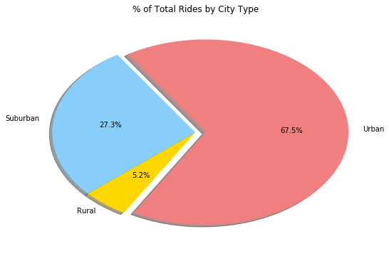

# Pyber Ride Sharing

### Analysis

Urban cities have 78.1% of Pyber drivers, 67.5% of total rides, and 62% of the total fares.  In this case correlation could mean causation; the data shows a relevant relationship between supply and demand.  Drivers > Riders > Fares could mean as more drivers enter the market, the fare price goes down; the market becomes more competitive for drivers.

Inversely to the first observable trend, the less competitive rural market results in fewer rides but higher average fares for these municipalities.

In terms of competition, the Suburban market was the best place to be a driver in 2016.  18.8% of Pyber drivers in these markets accounted for 31.4% of total fares.


```python
import os
import csv
import pandas as pd
import matplotlib.pyplot as plt
import numpy as np
import seaborn as sb
import nbconvert

city = pd.read_csv("raw_data/city_data.csv")
ride = pd.read_csv("raw_data/ride_data.csv")

pyber = pd.merge(ride, city, left_on='city', right_on='city')
pyber.head()
```


<div>
<style scoped>
    .dataframe tbody tr th:only-of-type {
        vertical-align: middle;
    }

    .dataframe tbody tr th {
        vertical-align: top;
    }

    .dataframe thead th {
        text-align: right;
    }
</style>
<table border="1" class="dataframe">
  <thead>
    <tr style="text-align: right;">
      <th></th>
      <th>city</th>
      <th>date</th>
      <th>fare</th>
      <th>ride_id</th>
      <th>driver_count</th>
      <th>type</th>
    </tr>
  </thead>
  <tbody>
    <tr>
      <th>0</th>
      <td>Sarabury</td>
      <td>2016-01-16 13:49:27</td>
      <td>38.35</td>
      <td>5403689035038</td>
      <td>46</td>
      <td>Urban</td>
    </tr>
    <tr>
      <th>1</th>
      <td>Sarabury</td>
      <td>2016-07-23 07:42:44</td>
      <td>21.76</td>
      <td>7546681945283</td>
      <td>46</td>
      <td>Urban</td>
    </tr>
    <tr>
      <th>2</th>
      <td>Sarabury</td>
      <td>2016-04-02 04:32:25</td>
      <td>38.03</td>
      <td>4932495851866</td>
      <td>46</td>
      <td>Urban</td>
    </tr>
    <tr>
      <th>3</th>
      <td>Sarabury</td>
      <td>2016-06-23 05:03:41</td>
      <td>26.82</td>
      <td>6711035373406</td>
      <td>46</td>
      <td>Urban</td>
    </tr>
    <tr>
      <th>4</th>
      <td>Sarabury</td>
      <td>2016-09-30 12:48:34</td>
      <td>30.30</td>
      <td>6388737278232</td>
      <td>46</td>
      <td>Urban</td>
    </tr>
  </tbody>
</table>
</div>


## Bubble Plot of Ride Sharing Data


```python
uavefare = pyber[pyber['type']=='Urban'].groupby(['city'])['fare'].mean()
utotride = pyber[pyber['type']=='Urban'].groupby(['city'])['ride_id'].count()
savefare = pyber[pyber['type']=='Suburban'].groupby(['city'])['fare'].mean()
stotride = pyber[pyber['type']=='Suburban'].groupby(['city'])['ride_id'].count()
ravefare = pyber[pyber['type']=='Rural'].groupby(['city'])['fare'].mean()
rtotride = pyber[pyber['type']=='Rural'].groupby(['city'])['ride_id'].count()

unumdriv = pyber[pyber['type']=='Urban'].groupby(['city'])['driver_count'].mean()
snumdriv = pyber[pyber['type']=='Suburban'].groupby(['city'])['driver_count'].mean()
rnumdriv = pyber[pyber['type']=='Rural'].groupby(['city'])['driver_count'].mean()

plt.figure(figsize=(9,6))
plt.ylim(0,60)
plt.xlim(0,40)
plt.title("Pyber Ride Sharing Data (2016)")
plt.ylabel('Average Fare ($)')
plt.xlabel('Total Number of Rides (Per City)')
plt.scatter(utotride,uavefare, s=unumdriv*10, c = 'LightCoral', edgecolor ='black', alpha = .5, label="Urban")
plt.scatter(stotride,savefare, s=snumdriv*10, c = 'LightSkyBlue', edgecolor ='black', alpha = .5, label="Suburban")
plt.scatter(rtotride,ravefare, s=rnumdriv*10, c = 'Gold', edgecolor ='black', alpha = .5, label="Rural")
plt.legend(title='City Types')
plt.show()
```


## Total Fares by City Type


```python
uavefare = pyber[pyber['type']=='Urban'].groupby(['city'])['fare'].sum()
savefare = pyber[pyber['type']=='Suburban'].groupby(['city'])['fare'].sum()
ravefare = pyber[pyber['type']=='Rural'].groupby(['city'])['fare'].sum()

plt.figure(figsize=(9,6))
plt.title('% of Total Fares by City Type')
plt.pie([uavefare.sum(),savefare.sum(),ravefare.sum()], explode=[0.07,0,0], labels=['Urban','Suburban','Rural'], colors=['lightcoral','lightskyblue','gold'],
        autopct="%1.1f%%", shadow=True, startangle=240)
plt.show()
```


## Total Rides by City Type


```python
plt.figure(figsize=(9,6))
plt.title('% of Total Rides by City Type')
plt.pie([utotride.sum(),stotride.sum(),rtotride.sum()], explode=[0.07,0,0], labels=['Urban','Suburban','Rural'], colors=['lightcoral','lightskyblue','gold'],
        autopct="%1.1f%%", shadow=True, startangle=240)
plt.show()
```





## Total Drivers by City Type


```python
plt.figure(figsize=(9,6))
plt.title('% of Total Drivers by City Type')
plt.pie([unumdriv.sum(),snumdriv.sum(),rnumdriv.sum()], explode=[0.07,0,0], labels=['Urban','Suburban','Rural'], colors=['lightcoral','lightskyblue','gold'],
        autopct="%1.1f%%", shadow=True, startangle=240)
plt.show()
```


